# Plant Layouts, Configurations & Operating Modes

*Complete technical reference for the PBTES solar thermal plant.*
*Updated: 2026-05-20*

---

## 1. System Components

Every configuration of the plant is assembled from the same set of components. Not all components are active in every mode.

| Component | Label in Code | Type | Role |
|-----------|---------------|------|------|
| **PTC Field** | `PTCField` | Solar collector | Converts DNI to thermal energy in the HTF |
| **Process HX** | `Process_HX` | SimpleHeatExchanger | Delivers 450 kW to the zinc galvanizing process |
| **Preheater HX** | `Preheater_HX` | SimpleHeatExchanger | Auxiliary / preheater (Q=0 in most modes) |
| **Charge HX** | `Charge_TES_HX` | HeatExchanger (indirect) or SimpleHeatExchanger (direct) | Transfers heat from primary loop to TES during charging |
| **Discharge HX** | `Discharge_TES_HX` | HeatExchanger (indirect) or SimpleHeatExchanger (direct) | Transfers heat from TES to process loop during discharging |
| **Packed Bed TES** | `TES` | 1D Schumann model | Stores thermal energy in rock/ceramic pebbles |
| **Splitter** | `Splitter1` | Node | Splits flow into two branches (Parallel topology, Mode 1 only) |
| **Merger** | `Merge2` | Node | Merges two branches back together (Parallel topology, Mode 1 only) |
| **Cycle Closer** | `CycleCloser` | Utility | Closes the thermodynamic loop for TESPy solver |
| **Zinc Pool** | `ZincPool` | Lumped-capacitance | Dynamic galvanizing bath model (always active, external to TESPy) |

### Key Temperatures and Pressures

| Connection | Label | Value | Description |
|------------|-------|-------|-------------|
| Preheater outlet | `conn_05` | T = 520 °C | Hot side inlet to Process HX |
| Process HX outlet | `conn_06` | T = 480 °C, p = 50 bar | Return temperature after delivering heat |
| TES charge secondary inlet | `conn_13` | p = 5 bar | Secondary loop (indirect only) |
| TES discharge secondary inlet | `conn_15` | p = 5 bar | Secondary loop (indirect only) |

---

## 2. The Two Configuration Axes

The plant topology is defined by two independent choices, creating a 2×2 matrix:

### 2.1 Topology: Parallel vs Series

**Parallel**: When both solar collection and TES charging/discharging happen simultaneously, the HTF flow is **split** at a Splitter node after the PTC. One branch goes to the process HX, the other to the TES HX. The branches rejoin at a Merge node before returning to the PTC.

**Series**: The HTF flows through all components **sequentially** in a single loop. For charging (Mode 1), the flow goes: PTC → Preheater → Process HX → Charge HX → back to PTC. The TES receives the cooler return fluid after the process has extracted its heat.

### 2.2 Tank Config: Indirect vs Direct

**Indirect**: The TES has its **own secondary loop** with a separate fluid circuit. A heat exchanger (HeatExchanger component with two sides: hot=primary, cold=secondary) couples the primary HTF loop to the TES secondary loop. The secondary loop has a Source and Sink representing the TES inlet/outlet.

**Direct**: The **primary HTF itself** flows directly through the packed bed. There is no secondary loop and no coupling heat exchanger. Instead, a SimpleHeatExchanger (pipe) represents the TES inline with the primary flow.

### 2.3 The Four Configurations

| # | Topology | Tank Config | Description |
|---|----------|-------------|-------------|
| 1 | **Parallel** | **Indirect** | Baseline. Split flow + HX coupling to TES secondary loop |
| 2 | **Parallel** | **Direct** | Split flow, HTF flows directly through packed bed |
| 3 | **Series** | **Indirect** | Sequential flow + HX coupling to TES secondary loop |
| 4 | **Series** | **Direct** | Sequential flow, HTF flows directly through packed bed |

---

## 3. Operating Modes

The solver selects one of 6 operating modes each timestep based on irradiance (E), TES state of charge (SoC), and temperatures.

| Mode | Name | Solar Active | TES Action | Aux Heater | When Selected |
|------|------|:------------:|:----------:|:----------:|---------------|
| **1** | Solar charges TES + process | ✓ | Charge ← | — | E > E_charge, SoC < 0.99, T_ptc > T_tes_top |
| **2** | Solar to process only | ✓ | Standby | — | E > E_process, TES full or charge not viable |
| **3** | TES discharge to process | — | Discharge → | — | E < E_process, SoC > 0.10, T_top in valid range |
| **4** | Standby (auxiliary) | — | Standby | ✓ | No sun, SoC exhausted |
| **5** | Solar charges TES (series) | ✓ | Charge ← | — | E > E_charge, T_top > T_ph_out, SoC < 0.90 |
| **6** | Solar charges TES + process (split) | ✓ | Charge ← | — | E > E_process, SoC < 0.40, T_top < 470°C |

### Mode Selection Thresholds

- **E_min_process** = Q_proc / (A_ptc × η_opt) ≈ 49 W/m² — minimum DNI to supply process heat
- **E_min_charge** = 1.5 × E_min_process ≈ 74 W/m² — minimum DNI for charging
- **SoC stickiness**: Mode 6 stays active while SoC < 0.80 and E > E_process
- **Discharge viability**: T_top must be between 500°C and 580°C

---

## 4. Full Plant Layout Diagrams

### 4.1 Parallel / Indirect — Full Layout

This is the **baseline** configuration. The primary HTF loop splits after the PTC: one branch serves the process, the other charges/discharges the TES via coupling heat exchangers. The TES has its own secondary fluid loop.

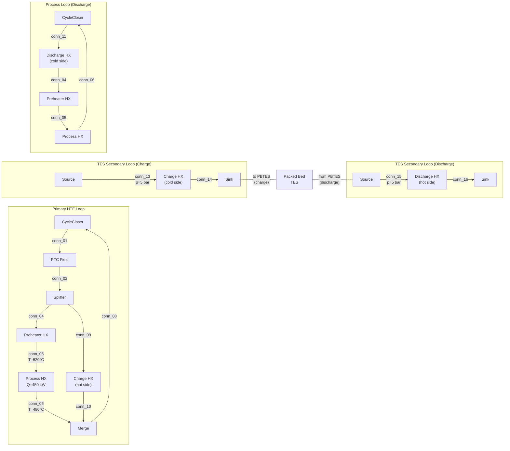

> [!NOTE]
> The charge and discharge loops are **never active simultaneously**. In charging modes (1, 5, 6), only the top portion is active. In discharge mode (3), only the bottom portion is active. Mode 2 and 4 use neither.

---

### 4.2 Parallel / Direct — Full Layout

Same parallel split topology, but the HTF flows **directly through the packed bed** instead of through a coupling HX. No secondary loop exists.

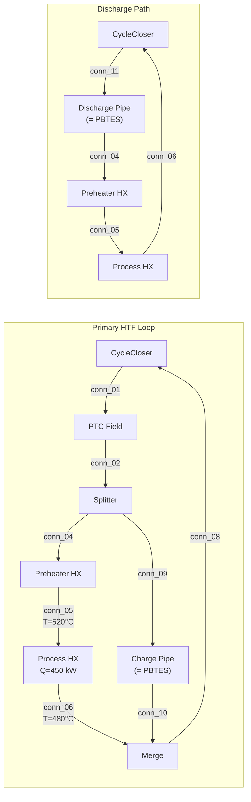

> [!IMPORTANT]
> In the direct configuration, `Charge_TES_Pipe` and `Discharge_TES_Pipe` are `SimpleHeatExchanger` components that represent the HTF flowing through the packed bed. The 1D Schumann model is solved externally and the resulting outlet temperature is fed back to TESPy.

---

### 4.3 Series / Indirect — Full Layout

All components are in a **single series loop**. During charging, the HTF first serves the process, then the cooler return charges the TES via a coupling HX.

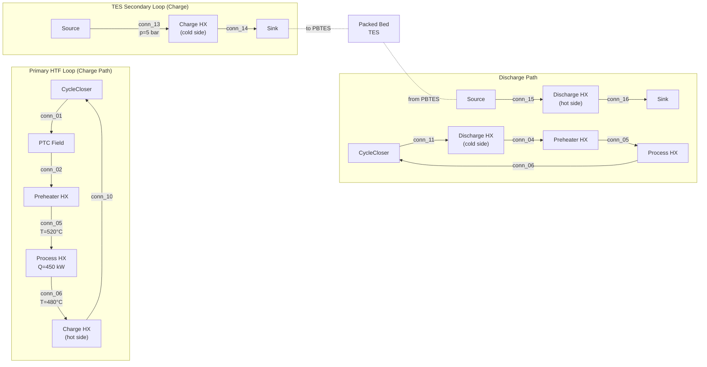

---

### 4.4 Series / Direct — Full Layout

Single series loop, but the HTF flows directly through the packed bed.

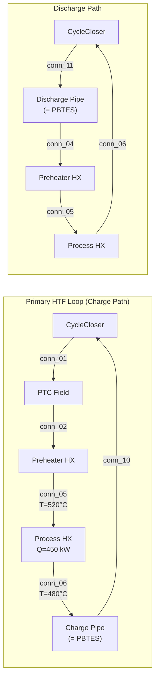

---

## 5. Mode-by-Mode Diagrams

Below are the active flow paths for each mode. Inactive components are omitted. The diagrams show what TESPy actually solves at each timestep.

### Notation

- **Bold arrows** = active flow path
- Connection labels (conn_XX) match the code variables
- Temperatures shown where they are set as boundary conditions
- `Q=450 kW` is the process heat demand (negative in code: -450,000 W)

---

### 5.1 Mode 1 — Solar Charges TES + Serves Process

**When**: High irradiance, TES not full, PTC outlet hotter than TES top.

The PTC heats the HTF. The flow is split (Parallel) or routed in series: part of the energy goes to the process, and the remainder charges the TES.

#### Mode 1 — Parallel / Indirect

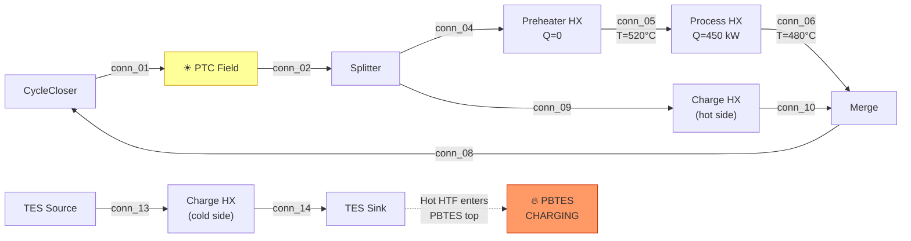

#### Mode 1 — Parallel / Direct

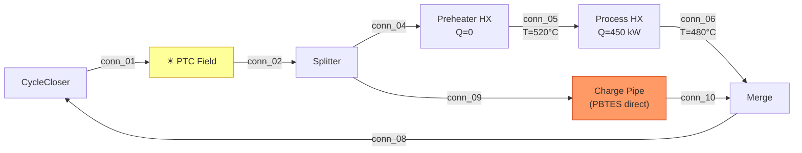

#### Mode 1 — Series / Indirect

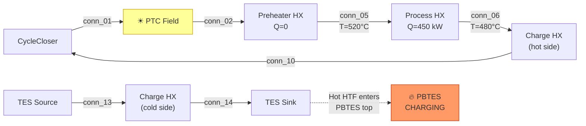

> [!NOTE]
> In Series Mode 1, the TES receives **cooler fluid** (post-process at ~480°C) compared to Parallel Mode 1 where it receives fluid directly from the PTC (~560°C). This is the fundamental thermodynamic trade-off between topologies.

#### Mode 1 — Series / Direct

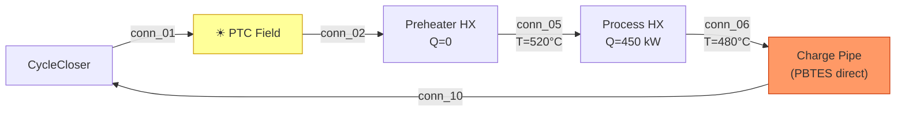

---

### 5.2 Mode 2 — Solar to Process Only (TES Standby)

**When**: Sufficient irradiance for process, but TES is full or charging is not viable.

Simple loop: PTC → Preheater → Process HX → back. No TES interaction. **Identical for all four configurations** (topology and tank config are irrelevant since the TES is bypassed).

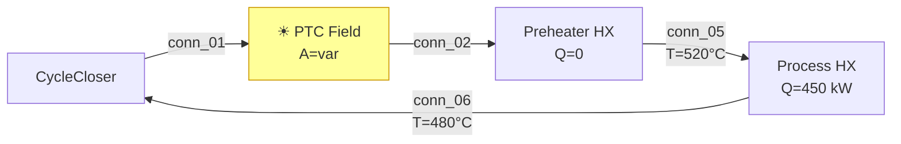

> [!TIP]
> In Mode 2, the PTC aperture area is set to `A='var'` (variable), meaning TESPy calculates the required aperture to exactly meet the process demand. This is the design-point sizing mechanism.

---

### 5.3 Mode 3 — TES Discharge to Process

**When**: Low or no irradiance, TES has sufficient charge (SoC > 0.10, T_top in 500–580°C range).

The PTC is **inactive**. Hot fluid from the TES supplies the process. The topology axis (Parallel/Series) is irrelevant here since there is no PTC.

#### Mode 3 — Indirect (both Parallel and Series)

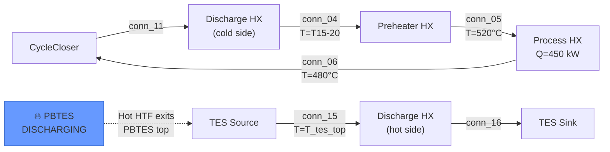

> [!IMPORTANT]
> The discharge HX outlet temperature (conn_04) is set as a `Ref` of conn_15: `T_04 = T_15 - 20°C`. This enforces the TTD constraint. The TES source temperature (conn_15) is updated iteratively by the Schumann model.

#### Mode 3 — Direct (both Parallel and Series)

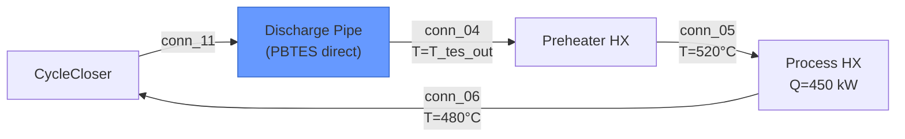

---

### 5.4 Mode 4 — Standby / Auxiliary Heater

**When**: No sun, TES exhausted (SoC < 0.05).

Minimal loop: Preheater supplies heat (acts as auxiliary), Process HX delivers to zinc pool. **No PTC, no TES interaction.** Identical for all configurations.

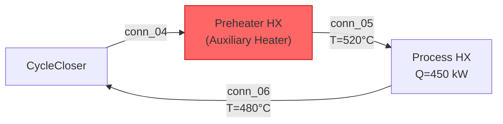

> [!NOTE]
> The Preheater HX in Mode 4 acts as an **auxiliary heater** (gas-fired or electric), supplying whatever heat is needed to maintain the zinc pool temperature. The Q is determined by the process demand.

---

### 5.5 Mode 5 — Solar Charges TES (Series, High-Temperature)

**When**: High irradiance, T_tes_top > T_ph_out (520°C), SoC < 0.90.

The entire PTC output flows in series: PTC → Charge HX → Preheater → Process HX → back. The TES receives heat from the high-temperature PTC outlet **before** the process extracts its share. This is the inverse of Mode 1 Series where the TES gets the post-process cooler fluid.

#### Mode 5 — Indirect

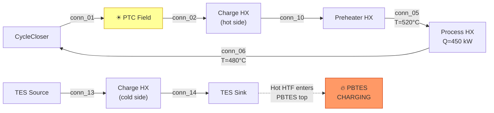

#### Mode 5 — Direct

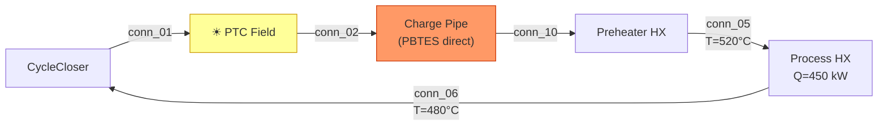

> [!NOTE]
> Mode 5 places the TES **upstream** of the process (PTC → TES → Process), unlike Mode 1 Series which places it **downstream** (PTC → Process → TES). This means Mode 5 charges the TES with the hottest fluid available.

---

### 5.6 Mode 6 — Solar Charges TES + Serves Process (Decoupled)

**When**: Moderate irradiance, TES is cold (SoC < 0.40, T_top < 470°C). This mode is "sticky" — it persists until SoC reaches 0.80.

The behavior differs significantly between Parallel and Series:

#### Mode 6 — Parallel (Two independent cycles)

In Parallel Mode 6, two **completely independent cycles** operate simultaneously:
- **Cycle A** (solar → TES): PTC → Charge HX → CycleCloser (dedicated to charging)
- **Cycle B** (process): CycleCloser2 → Preheater → Process HX → CycleCloser2

These are thermally decoupled. The PTC output goes **entirely** to charging; the process runs on its own recirculating loop (effectively auxiliary-heated).

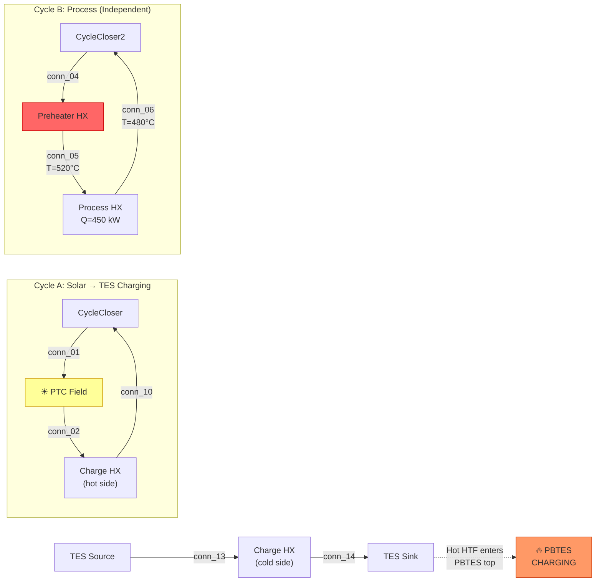

#### Mode 6 — Series (Single loop: PTC → Process → TES)

In Series Mode 6, it works exactly like Mode 1 Series: PTC → Preheater → Process → Charge HX → back. The post-process fluid charges the TES.

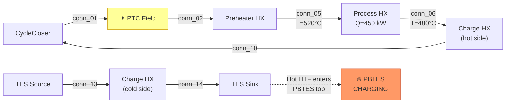

> [!WARNING]
> **Mode 6 Parallel design currently fails** with "too many parameters: 13 required, 14 supplied". This is a known Phase C issue. At runtime, Mode 6 falls back to Mode 4 when this occurs.

---

## 6. TES Coupling Iteration

The TES is **not inside** TESPy. Instead, the solver iterates between TESPy and the 1D Schumann model:

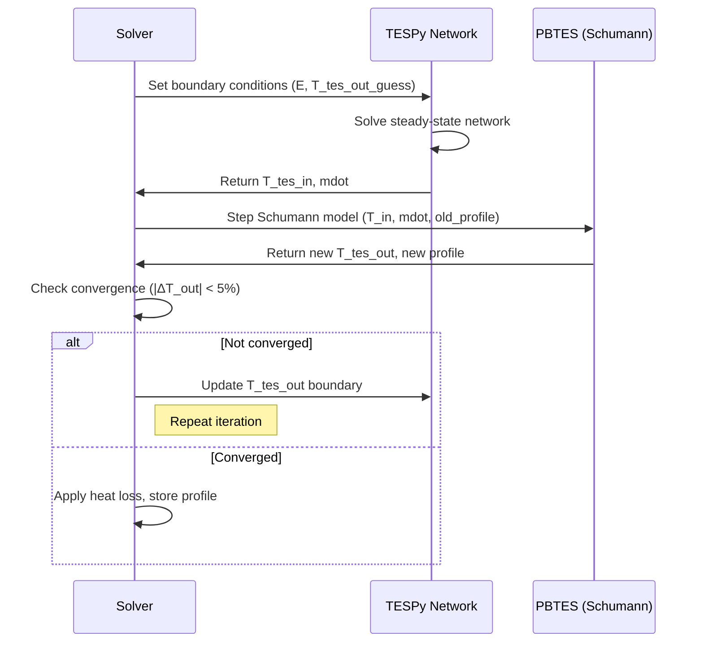

### Charging flow direction
- Hot fluid enters the **top** of the packed bed
- Cold fluid exits the **bottom**
- Profile array: index 0 = top (hot), index N = bottom (cold)

### Discharging flow direction
- Cold fluid enters the **bottom** of the packed bed
- Hot fluid exits the **top**
- Profile array is reversed for the Schumann model

---

## 7. Summary Matrix: Which Components are Active per Mode

| Component | M1 | M2 | M3 | M4 | M5 | M6-Par | M6-Ser |
|-----------|:--:|:--:|:--:|:--:|:--:|:------:|:------:|
| PTC Field | ✓ | ✓ | — | — | ✓ | ✓ | ✓ |
| Preheater HX | Q=0 | Q=0 | ✓ | ✓ (aux) | ✓ | ✓ (aux) | Q=0 |
| Process HX | ✓ | ✓ | ✓ | ✓ | ✓ | ✓ | ✓ |
| Charge HX | ✓ | — | — | — | ✓ | ✓ | ✓ |
| Discharge HX | — | — | ✓ | — | — | — | — |
| Splitter | ✓* | — | — | — | — | — | — |
| Merge | ✓* | — | — | — | — | — | — |
| CycleCloser2 | — | — | — | — | — | ✓ | — |
| PBTES | charge | — | discharge | — | charge | charge | charge |

*Splitter and Merge are only used in **Parallel Mode 1**.

---

## 8. Connection Label Reference

| Label | From → To | Used in Modes |
|-------|-----------|---------------|
| `conn_01` | CycleCloser → PTC | 1, 2, 5, 6 |
| `conn_02` | PTC → Splitter (Par) or PTC → Preheater (Ser) or PTC → ChargeHX (M5/M6) | 1, 2, 5, 6 |
| `conn_04` | Splitter → Preheater (Par M1) or DischargeHX → Preheater (M3) or CC → Preheater (M4) or CC2 → Preheater (M6-Par) | 1, 3, 4, 6 |
| `conn_05` | Preheater → Process HX (T=520°C) | All |
| `conn_06` | Process HX → next component (T=480°C, p=50 bar) | All |
| `conn_08` | Merge → CycleCloser (Parallel M1 only) | 1 |
| `conn_09` | Splitter → Charge HX (Parallel M1 only) | 1 |
| `conn_10` | Charge HX → Merge (Par M1) or ChargeHX → CC (Ser) or ChargeHX → Preheater (M5) | 1, 5, 6 |
| `conn_11` | CycleCloser → Discharge HX (M3) | 3 |
| `conn_13` | TES charge Source → Charge HX cold side (indirect only) | 1, 5, 6 |
| `conn_14` | Charge HX cold side → TES charge Sink (indirect only) | 1, 5, 6 |
| `conn_15` | TES discharge Source → Discharge HX hot side (indirect only) | 3 |
| `conn_16` | Discharge HX hot side → TES discharge Sink (indirect only) | 3 |
