# Plant Layouts, Configurations & Operating Modes

*Complete technical reference for the PBTES solar thermal plant.*
*Updated: 2026-05-20*

---

## 1. System Components

Every configuration of the plant is assembled from the same set of components. Not all components are active in every mode.

| Component | Label in Code | Type | Role |
|-----------|---------------|------|------|
| **PTC Field** | `PTCField` | Solar collector | Converts DNI to thermal energy in the HTF |
| **Process HX** | `Process_HX` | SimpleHeatExchanger | Delivers 450 kW to the zinc galvanizing process |
| **Preheater HX** | `Preheater_HX` | SimpleHeatExchanger | Auxiliary heater (gas/electric) for process backup |
| **Charge HX** | `Charge_TES_HX` | HeatExchanger (indirect only) | Couples primary loop to TES secondary loop during normal charging |
| **High-T Charge HX** | `Charge_TES_HX` (Mode 5) | HeatExchanger (indirect only) | Separate HX in parallel with Charge HX for high-temperature charging |
| **Discharge HX** | `Discharge_TES_HX` | HeatExchanger (indirect only) | Couples TES secondary loop to process loop during discharging |
| **Packed Bed TES** | `TES` | 1D Schumann model | Stores thermal energy in rock/ceramic pebbles |
| **Splitter** | `Splitter1` | Node | Splits flow into two branches (Parallel topology, Mode 1) |
| **Merger** | `Merge2` | Node | Merges two branches back together (Parallel topology, Mode 1) |
| **Zinc Pool** | `ZincPool` | Lumped-capacitance | Dynamic galvanizing bath model (always active, external to TESPy) |
| **Pump (Primary)** | `Pump` | Pump | Circulates HTF through the primary (PTC/process) loop |
| **Pump (Secondary)** | `Pump2` | Pump | Circulates HTF through the TES secondary loop (indirect only) |

### Key Temperatures and Pressures

| Point | Value | Description |
|-------|-------|-------------|
| Preheater outlet | T = 520 °C | Hot side inlet to Process HX |
| Process HX outlet | T = 480 °C, p = 50 bar | Return temperature after delivering heat |
| TES charge secondary | p = 5 bar | Secondary loop pressure (indirect only) |
| TES discharge secondary | p = 5 bar | Secondary loop pressure (indirect only) |

---

## 2. The Two Configuration Axes

The plant topology is defined by two independent choices, creating a 2×2 matrix:

### 2.1 Topology: Parallel vs Series

**Parallel**: When both solar collection and TES charging happen simultaneously, the HTF flow is **split** at a Splitter node after the PTC. One branch goes to the process HX, the other to the TES charge HX. The branches rejoin at a Merge node before returning to the PTC. Modes 5 and 6 are exclusive to this topology.

**Series**: The HTF flows through all components **sequentially** in a single loop. For charging (Mode 1), the flow goes: PTC → Preheater → Process HX → Charge HX → back to PTC. The TES receives the cooler return fluid after the process has extracted its heat.

### 2.2 Tank Config: Indirect vs Direct

**Indirect**: The TES has its **own secondary loop** with a separate fluid circuit. A heat exchanger (HeatExchanger component with two sides: hot=primary, cold=secondary) couples the primary HTF loop to the TES secondary loop. The secondary loop circulates HTF through the packed bed and back through the coupling HX. A **secondary pump** drives this loop when active.

**Direct**: The primary HTF itself flows directly through the TES, which uses a **two-tank arrangement** (hot tank + cold tank), both with internal thermal stratification. During charging, HTF flows from the cold tank through the packed bed to the hot tank. During discharging, the flow reverses. There is no coupling HX and no secondary loop.

> [!NOTE]
> In TESPy, the direct configuration models the TES path using `SimpleHeatExchanger` components labeled as "pipes" (`Charge_TES_Pipe`, `Discharge_TES_Pipe`). These are **modeling references only** — they represent the temperature change as HTF passes through the packed bed. The actual physics is solved by the external 1D Schumann model.

### 2.3 The Four Configurations

| # | Topology | Tank Config | Description |
|---|----------|-------------|-------------|
| 1 | **Parallel** | **Indirect** | Baseline. Split flow + HX coupling to TES secondary loop |
| 2 | **Parallel** | **Direct** | Split flow, 2-tank TES, HTF flows directly through packed bed |
| 3 | **Series** | **Indirect** | Sequential flow + HX coupling to TES secondary loop |
| 4 | **Series** | **Direct** | Sequential flow, 2-tank TES, HTF flows directly through packed bed |

---

## 3. Operating Modes

The solver selects one of 6 operating modes each timestep based on irradiance (E), TES state of charge (SoC), and temperatures.

| Mode | Name | Solar | TES Action | Aux | Topology | When Selected |
|------|------|:-----:|:----------:|:---:|:--------:|---------------|
| **1** | Solar charges TES + process | ✓ | Charge ← | — | Both | E > E_charge, SoC < 0.99, T_ptc > T_tes_top |
| **2** | Solar to process only | ✓ | Standby | — | Both | E > E_process, TES full or charge not viable |
| **3** | TES discharge to process | — | Discharge → | — | Both | E < E_process, SoC > 0.10, T_top in valid range |
| **4** | Standby (auxiliary only) | — | Standby | ✓ | Both | No sun, SoC exhausted |
| **5** | High-T solar charges TES | ✓ | Charge ← | ✓ | **Parallel only** | E > E_charge, T_top > 520°C, SoC < 0.90 |
| **6** | Solar charges TES + process (split) | ✓ | Charge ← | ✓* | **Parallel only** | E > E_process, SoC < 0.40, T_top < 470°C |

*Mode 6 Parallel: process runs on an independent auxiliary-heated cycle.

### Mode Descriptions

**Mode 1 — Solar Charges TES + Serves Process**: The PTC heats the HTF. In Parallel, the flow splits: one branch serves the process, the other charges the TES. In Series, the HTF flows sequentially through process then TES. The Preheater is bypassed (Q=0).

**Mode 2 — Solar to Process Only**: Simple loop. PTC heats HTF, which delivers heat to the process. TES is in standby (no charging or discharging). Identical network for all configurations.

**Mode 3 — TES Discharge to Process**: No solar input. Hot HTF from the TES top supplies heat to the process via the Discharge HX (indirect) or directly (direct). The PTC is completely offline.

**Mode 4 — Standby / Auxiliary**: No solar, TES exhausted. The Preheater HX acts as the auxiliary heater (gas-fired or electric), supplying all process heat. Minimal loop with only the process components.

**Mode 5 — High-Temperature Solar Charging (Parallel only)**: Uses a dedicated **High-Temperature Charge HX** installed in parallel with the regular Charge HX. The PTC output first passes through the High-T HX (transferring heat to the TES secondary at the highest temperature), then continues to the Preheater and Process HX. In other modes, HTF bypasses the High-T HX through a parallel pipe. The Preheater acts as auxiliary to supplement process heat if needed.

**Mode 6 — Solar Charges TES + Process (Decoupled, Parallel only)**: Two completely independent cycles operate simultaneously. Cycle A: PTC → Charge HX → PTC (dedicated to TES charging). Cycle B: Preheater (auxiliary) → Process HX → Preheater (dedicated to process). Each cycle has its own pump.

### Mode Selection Thresholds

- **E_min_process** = Q_proc / (A_ptc × η_opt) ≈ 49 W/m² — minimum DNI to supply process heat
- **E_min_charge** = 1.5 × E_min_process ≈ 74 W/m² — minimum DNI for charging
- **SoC stickiness**: Mode 6 stays active while SoC < 0.80 and E > E_process
- **Discharge viability**: T_top must be between 500°C and 580°C

---

## 4. Full Plant Layout Diagrams

These show the **complete physical plant** for each configuration, including all components that may be used across any mode. Inactive paths in a given mode are simply not used (valves close, pumps stop).

### 4.1 Parallel / Indirect — Full Layout

This is the **baseline** configuration. The primary loop splits after the PTC. The TES has its own secondary loop driven by a secondary pump. The High-T Charge HX for Mode 5 sits in parallel with the regular Charge HX path.

```mermaid
graph TD
    subgraph "Primary Loop"
        P1["⚙ Pump 1"] --> PTC["☀ PTC Field"]
        PTC --> SP["Splitter"]
        SP -->|"Process branch"| PH["Preheater HX<br/>(Auxiliary)"]
        PH -->|"T=520°C"| PR["Process HX<br/>Q=450 kW"]
        PR -->|"T=480°C"| MG["Merge"]
        SP -->|"TES branch"| CHX_H["Charge HX<br/>(hot side)"]
        CHX_H --> MG
        SP -.->|"Mode 5 only"| HT_H["High-T Charge HX<br/>(hot side)"]
        HT_H -.-> PH
        MG --> P1
    end

    subgraph "TES Secondary Loop"
        P2["⚙ Pump 2"] --> PBTES["🔥 PBTES<br/>Packed Bed"]
        PBTES --> CHX_C["Charge HX<br/>(cold side)"]
        CHX_C --> P2
        PBTES --> HT_C["High-T Charge HX<br/>(cold side)"]
        HT_C --> P2
    end

    subgraph "TES Discharge Secondary Loop"
        P2D["⚙ Pump 2"] --> PBTES2["🔥 PBTES"]
        PBTES2 --> DHX_H["Discharge HX<br/>(hot side)"]
        DHX_H --> P2D
    end

    subgraph "Process Discharge Loop"
        DHX_C["Discharge HX<br/>(cold side)"] --> PH2["Preheater HX"]
        PH2 --> PR2["Process HX"]
        PR2 --> P1D["⚙ Pump 1"]
        P1D --> DHX_C
    end
```

> [!NOTE]
> The charge and discharge secondary loops share the same physical pump and PBTES, but are shown separately for clarity. They **never operate simultaneously** — charging modes (1, 5, 6) and discharge mode (3) are mutually exclusive.

---

### 4.2 Parallel / Direct — Full Layout

Same parallel split topology, but the HTF flows **directly through the packed bed** between two tanks (hot and cold). No coupling HX, no secondary loop. Only one pump needed for most modes.

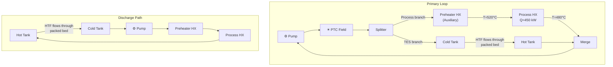

> [!IMPORTANT]
> In the 2-tank direct arrangement: during **charging**, HTF enters the cold tank bottom, flows up through the packed bed, and exits into the hot tank. During **discharging**, the flow reverses — HTF exits the hot tank top, flows down through the bed, and returns to the cold tank. Both tanks maintain internal thermal stratification.

---

### 4.3 Series / Indirect — Full Layout

All components are in a **single series loop**. During charging, the HTF first serves the process, then the cooler return charges the TES via a coupling HX. No Splitter/Merge needed.

```mermaid
graph TD
    subgraph "Primary Loop (Charge Path)"
        P1["⚙ Pump 1"] --> PTC["☀ PTC Field"]
        PTC --> PH["Preheater HX<br/>(Auxiliary)"]
        PH -->|"T=520°C"| PR["Process HX<br/>Q=450 kW"]
        PR -->|"T=480°C"| CHX_H["Charge HX<br/>(hot side)"]
        CHX_H --> P1
    end

    subgraph "TES Secondary Loop (Charge)"
        P2["⚙ Pump 2"] --> PBTES["🔥 PBTES<br/>Packed Bed"]
        PBTES --> CHX_C["Charge HX<br/>(cold side)"]
        CHX_C --> P2
    end

    subgraph "TES Discharge Secondary Loop"
        P2D["⚙ Pump 2"] --> PBTES2["🔥 PBTES"]
        PBTES2 --> DHX_H["Discharge HX<br/>(hot side)"]
        DHX_H --> P2D
    end

    subgraph "Process Discharge Loop"
        DHX_C["Discharge HX<br/>(cold side)"] --> PH2["Preheater HX"]
        PH2 --> PR2["Process HX"]
        PR2 --> P1D["⚙ Pump 1"]
        P1D --> DHX_C
    end
```

---

### 4.4 Series / Direct — Full Layout

Single series loop, HTF flows directly through the 2-tank packed bed.

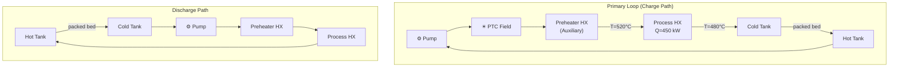

---

## 5. Mode-by-Mode Diagrams

Below are the **active flow paths** for each mode. Only the components and connections that are operational are shown. Pumps are included where they drive flow.

### Notation

- Solid arrows = active flow
- Temperatures shown where set as boundary conditions
- `Q=450 kW` is the process heat demand

---

### 5.1 Mode 1 — Solar Charges TES + Serves Process

**When**: High irradiance, TES not full, PTC outlet hotter than TES top.

#### Mode 1 — Parallel / Indirect

The PTC output is split: one branch goes to process, the other charges the TES via the Charge HX. Two pumps: primary loop + TES secondary loop.

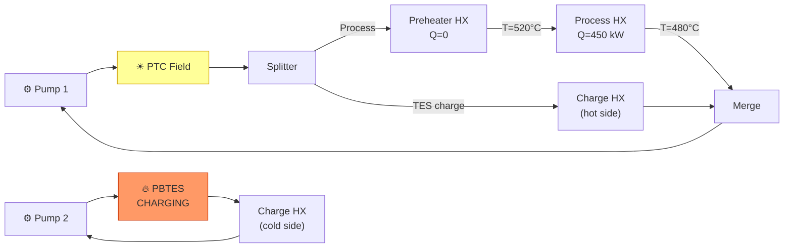

#### Mode 1 — Parallel / Direct

Split flow; one branch goes to process, the other flows directly through the packed bed from cold to hot tank. Single pump.

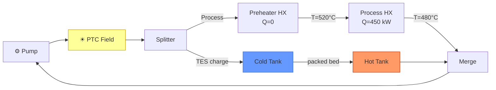

#### Mode 1 — Series / Indirect

The HTF flows in series: PTC → Preheater → Process → Charge HX → back. The TES receives the **post-process fluid at ~480°C** (cooler than Parallel). Two pumps.

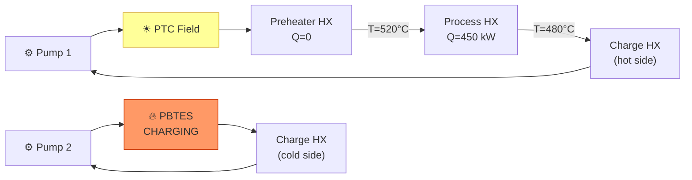

> [!NOTE]
> In Series Mode 1, the TES receives **cooler fluid** (post-process at ~480°C) compared to Parallel Mode 1 where it receives fluid directly from the PTC (~560°C). This is the fundamental thermodynamic trade-off between topologies.

#### Mode 1 — Series / Direct

HTF flows in series through everything including directly through the packed bed. Single pump.

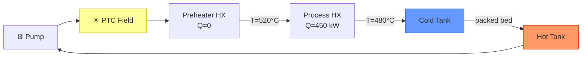

---

### 5.2 Mode 2 — Solar to Process Only (TES Standby)

**When**: Sufficient irradiance for process, but TES is full or charging is not viable.

Simple loop: PTC → Preheater → Process HX → back. No TES interaction. **Identical for all four configurations.** Single pump.

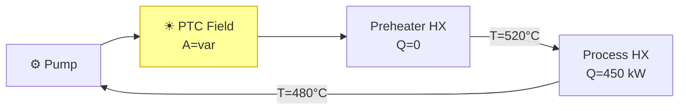

> [!TIP]
> In Mode 2, the PTC aperture area is set to `A='var'` (variable), meaning TESPy calculates the required aperture to exactly meet the process demand at the current irradiance. This is the design-point sizing mechanism.

---

### 5.3 Mode 3 — TES Discharge to Process

**When**: Low or no irradiance, TES has sufficient charge (SoC > 0.10, T_top in 500–580°C range).

The PTC is **inactive**. Hot fluid from the TES supplies the process. The topology axis (Parallel/Series) is irrelevant since there is no PTC. The Preheater supplements heat if TES outlet is not hot enough.

#### Mode 3 — Indirect (both Parallel and Series)

The TES secondary loop pushes hot HTF through the Discharge HX to heat the process loop. Two pumps: process loop + TES secondary.

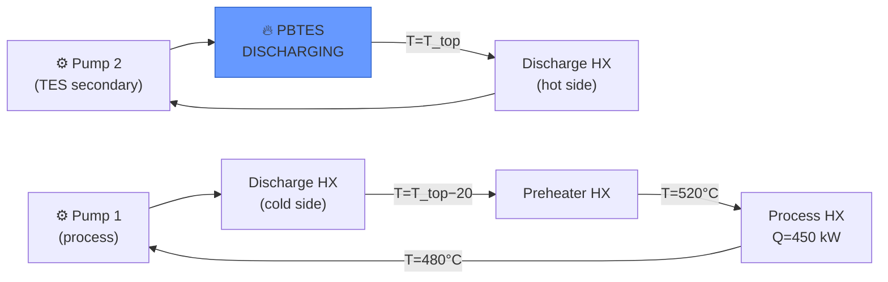

> [!IMPORTANT]
> The Discharge HX outlet temperature on the process side is set as T_top − 20°C (the TTD constraint). The TES outlet temperature is updated iteratively by the Schumann model until convergence.

#### Mode 3 — Direct (both Parallel and Series)

HTF flows directly from the hot tank through the packed bed to the cold tank, then to the process. Single pump.

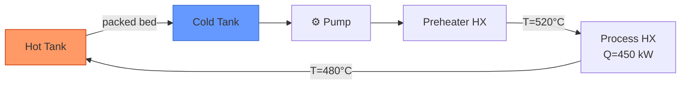

---

### 5.4 Mode 4 — Standby / Auxiliary Heater

**When**: No sun, TES exhausted (SoC < 0.05).

Minimal loop: Preheater (auxiliary heater) supplies all heat, Process HX delivers to zinc pool. **No PTC, no TES interaction.** Identical for all configurations. Single pump.

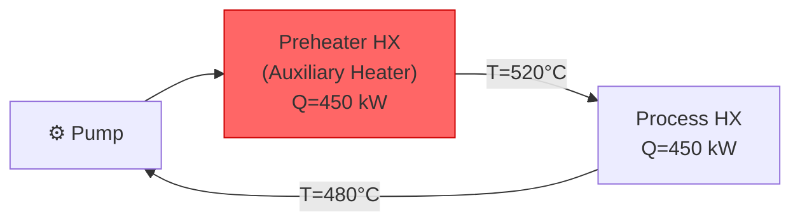

> [!NOTE]
> The Preheater HX in Mode 4 acts as an **auxiliary heater** (gas-fired or electric), supplying whatever heat is needed to maintain the zinc pool temperature.

---

### 5.5 Mode 5 — High-Temperature Solar Charging (Parallel Only)

**When**: High irradiance, T_tes_top > 520°C, SoC < 0.90. **Parallel topology only.**

This mode uses a dedicated **High-Temperature Charge HX** that is physically separate from the regular Charge HX used in Mode 1. They are installed **in parallel** in the plant. In other modes, the HTF bypasses the High-T HX through a parallel pipe.

The primary loop flow is: PTC → **High-T Charge HX** → Preheater → Process HX → back to PTC. The TES secondary loop circulates through the cold side of the High-T HX. The TES receives the **hottest fluid** from the PTC outlet before any heat is extracted for the process.

#### Mode 5 — Parallel / Indirect

Two pumps: primary + TES secondary.

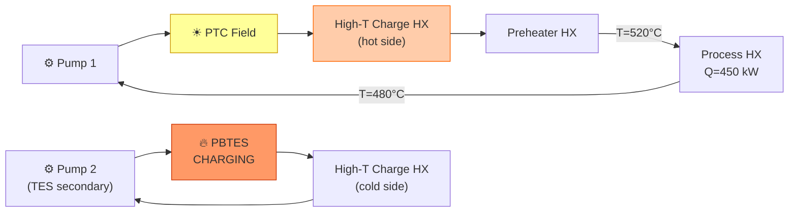

#### Mode 5 — Parallel / Direct

Single pump. PTC → packed bed (hot tank) → Preheater → Process → cold tank → PTC.

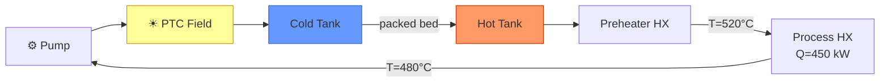

> [!NOTE]
> Mode 5 places the TES **upstream** of the process (PTC → TES → Process), unlike Mode 1 Series which places the TES **downstream** (PTC → Process → TES). This means Mode 5 charges the TES with the hottest fluid available, at the cost of the process receiving cooler HTF (supplemented by the Preheater/auxiliary if needed).

---

### 5.6 Mode 6 — Solar Charges TES + Process (Decoupled, Parallel Only)

**When**: Moderate irradiance, TES is cold (SoC < 0.40, T_top < 470°C). This mode is "sticky" — it persists until SoC reaches 0.80. **Parallel topology only.**

Two **completely independent cycles** operate simultaneously, each with its own pump:
- **Cycle A** (Solar → TES): PTC output goes entirely to charging the TES
- **Cycle B** (Process): Preheater acts as auxiliary heater, supplying all process heat independently

#### Mode 6 — Parallel / Indirect

Two pumps (one per cycle) + TES secondary pump = 3 active pumps.

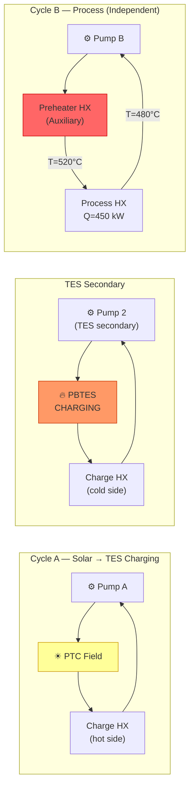

#### Mode 6 — Parallel / Direct

Two pumps (one per cycle). No secondary loop needed.

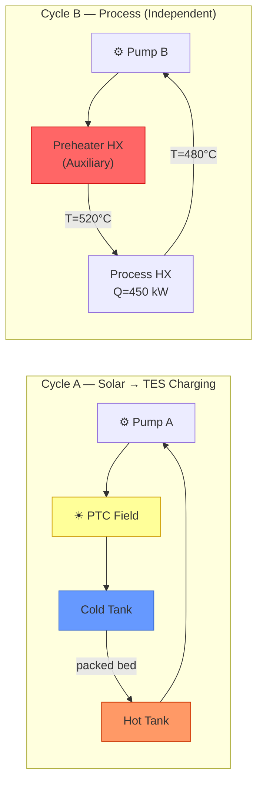

> [!WARNING]
> **Mode 6 Parallel design currently fails** in TESPy with "too many parameters: 13 required, 14 supplied". This is a known Phase C issue. At runtime, Mode 6 falls back to Mode 4 when this occurs.

---

## 6. TES Coupling Iteration

The TES is **not inside** TESPy. Instead, the solver iterates between TESPy and the 1D Schumann model:

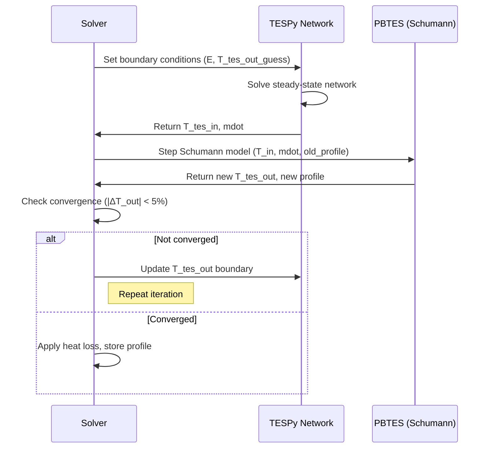

### Charging flow direction
- Hot fluid enters the **top** of the packed bed
- Cold fluid exits the **bottom**
- Profile array: index 0 = top (hot), index N = bottom (cold)

### Discharging flow direction
- Cold fluid enters the **bottom** of the packed bed
- Hot fluid exits the **top**
- Profile array is reversed for the Schumann model

---

## 7. Summary Matrix: Which Components are Active per Mode

| Component | M1 | M2 | M3 | M4 | M5 | M6-Par |
|-----------|:--:|:--:|:--:|:--:|:--:|:------:|
| PTC Field | ✓ | ✓ | — | — | ✓ | ✓ |
| Preheater HX | Q=0 | Q=0 | ✓ | ✓ (aux) | ✓ | ✓ (aux) |
| Process HX | ✓ | ✓ | ✓ | ✓ | ✓ | ✓ |
| Charge HX | ✓ | — | — | — | — | ✓ |
| High-T Charge HX | — | — | — | — | ✓ | — |
| Discharge HX | — | — | ✓ | — | — | — |
| Splitter / Merge | ✓* | — | — | — | — | — |
| PBTES | charge | — | discharge | — | charge | charge |
| Pump 1 (primary) | ✓ | ✓ | ✓ | ✓ | ✓ | ✓ (×2) |
| Pump 2 (secondary) | ✓† | — | ✓† | — | ✓† | ✓† |

*Splitter/Merge only in Parallel Mode 1.
†Pump 2 only in Indirect configurations.

---

## 8. Pump Summary per Mode and Configuration

| Mode | Parallel/Indirect | Parallel/Direct | Series/Indirect | Series/Direct |
|------|:-----------------:|:---------------:|:---------------:|:-------------:|
| 1 | 2 pumps (primary + secondary) | 1 pump | 2 pumps (primary + secondary) | 1 pump |
| 2 | 1 pump | 1 pump | 1 pump | 1 pump |
| 3 | 2 pumps (process + secondary) | 1 pump | 2 pumps (process + secondary) | 1 pump |
| 4 | 1 pump | 1 pump | 1 pump | 1 pump |
| 5 | 2 pumps (primary + secondary) | 1 pump | N/A | N/A |
| 6 | 3 pumps (solar cycle + process cycle + secondary) | 2 pumps (solar cycle + process cycle) | N/A | N/A |

---

## 9. Connection Label Reference

| Label | From → To | Used in Modes |
|-------|-----------|---------------|
| `conn_01` | Pump → PTC | 1, 2, 5, 6 |
| `conn_02` | PTC → Splitter (Par) or PTC → Preheater (Ser) or PTC → ChargeHX (M5/M6) | 1, 2, 5, 6 |
| `conn_04` | Splitter → Preheater (Par M1) or DischargeHX → Preheater (M3) or Pump → Preheater (M4) or CC2 → Preheater (M6-Par) | 1, 3, 4, 6 |
| `conn_05` | Preheater → Process HX (T=520°C) | All |
| `conn_06` | Process HX → next component (T=480°C, p=50 bar) | All |
| `conn_08` | Merge → Pump (Parallel M1 only) | 1 |
| `conn_09` | Splitter → Charge HX (Parallel M1 only) | 1 |
| `conn_10` | Charge HX → Merge (Par M1) or ChargeHX → Pump (Ser) or HighT-HX → Preheater (M5) | 1, 5, 6 |
| `conn_11` | Pump → Discharge HX cold side (M3) | 3 |
| `conn_13` | PBTES → Charge HX cold side (indirect only) | 1, 5, 6 |
| `conn_14` | Charge HX cold side → PBTES (indirect only) | 1, 5, 6 |
| `conn_15` | PBTES → Discharge HX hot side (indirect only) | 3 |
| `conn_16` | Discharge HX hot side → PBTES (indirect only) | 3 |
