# Plant Layouts, Configurations & Operating Modes

*Complete technical reference for the PBTES solar thermal plant.*
*Updated: 2026-05-20 — v3.0: Redesigned direct configuration with 2-tank parallel discharge mixing*

---

## 1. System Components

Every configuration of the plant is assembled from the same set of components. Not all components are active in every mode.

| Component | Label in Code | Type | Role |
|-----------|---------------|------|------|
| **PTC Field** | `PTCField` | Solar collector | Converts DNI to thermal energy in the HTF |
| **Process HX** | `Process_HX` | SimpleHeatExchanger | Delivers 450 kW to the zinc galvanizing process |
| **Preheater HX** | `Preheater_HX` | SimpleHeatExchanger | Auxiliary heater (gas/electric) for process backup |
| **Charge HX** | `Charge_TES_HX` | HeatExchanger (indirect only) | Couples primary loop to TES secondary loop during normal charging |
| **High-T Charge HX** | `Charge_TES_HX` (Mode 5) | HeatExchanger (indirect only) | Separate HX in parallel with Charge HX for high-temperature charging |
| **Discharge HX** | `Discharge_TES_HX` | HeatExchanger (indirect only) | Couples TES secondary loop to process loop during discharging |
| **Packed Bed TES** | `TES` | 1D Schumann model | Stores thermal energy in rock/ceramic pebbles |
| **Hot Tank** | — | Storage tank (direct only) | Stores high-grade heat at PTC outlet temperature (~560°C); contains packed bed |
| **Cold Tank** | — | Storage tank (direct only) | Stores lower-grade heat at process return temperature (~480°C); contains packed bed |
| **Mixing Valve** | — | 3-way valve (direct only) | Blends Hot Tank and Cold Tank outlets during discharge to control process inlet temperature |
| **Splitter** | `Splitter1` | Node | Splits flow into two branches (Parallel topology, Mode 1) |
| **Merger** | `Merge2` | Node | Merges two branches back together (Parallel topology, Mode 1) |
| **Zinc Pool** | `ZincPool` | Lumped-capacitance | Dynamic galvanizing bath model (always active, external to TESPy) |
| **Pump (Primary)** | `Pump` | Pump | Circulates HTF through the primary (PTC/process) loop |
| **Pump (Secondary)** | `Pump2` | Pump | Circulates HTF through the TES secondary loop (indirect only) |

### Key Temperatures and Pressures

| Point | Value | Description |
|-------|-------|-------------|
| Preheater outlet | T = 520 °C | Hot side inlet to Process HX |
| Process HX outlet | T = 480 °C, p = 50 bar | Return temperature after delivering heat |
| TES charge secondary | p = 5 bar | Secondary loop pressure (indirect only) |
| TES discharge secondary | p = 5 bar | Secondary loop pressure (indirect only) |

---

## 2. The Two Configuration Axes

The plant topology is defined by two independent choices, creating a 2×2 matrix:

### 2.1 Topology: Parallel vs Series

**Parallel**: When both solar collection and TES charging happen simultaneously, the HTF flow is **split** at a Splitter node after the PTC. One branch goes to the process HX, the other to the TES charge HX. The branches rejoin at a Merge node before returning to the PTC. Modes 5 and 6 are exclusive to this topology.

**Series**: The HTF flows through all components **sequentially** in a single loop. For charging (Mode 1) in indirect configs, the flow goes: PTC → Preheater → Process HX → Charge HX → back to PTC. The TES receives the cooler return fluid after the process has extracted its heat. In direct configs, the Hot Tank is placed **upstream** of the process (PTC → Hot Tank → Preheater → Process → Cold Tank → PTC) to capture the full PTC output temperature.

### 2.2 Tank Config: Indirect vs Direct

**Indirect**: The TES has its **own secondary loop** with a separate fluid circuit. A heat exchanger (HeatExchanger component with two sides: hot=primary, cold=secondary) couples the primary HTF loop to the TES secondary loop. The secondary loop circulates HTF through the packed bed and back through the coupling HX. A **secondary pump** drives this loop when active.

**Direct**: The primary HTF flows directly through the packed bed — **no coupling heat exchangers** are needed, reducing capital cost. The system uses a **two-tank arrangement**, each containing a packed bed with internal thermal stratification:

- **Hot Tank**: Stores high-grade thermal energy at the PTC outlet temperature (~560°C).
- **Cold Tank**: Stores lower-grade thermal energy at the process return temperature (~480°C).

During **charging**, the Hot Tank receives hot HTF from the PTC outlet (directly or via a splitter branch), while the Cold Tank receives the cooler process return (~480°C). Each tank charges independently at its respective temperature level.

During **discharging**, both tanks release hot fluid from their tops **in parallel**. A **mixing valve** blends the two streams at a controlled mass flow ratio to achieve the target process inlet temperature (≥520°C). The process return (~480°C) is split back to both tank bottoms proportionally. This parallel-discharge strategy avoids putting the tanks in series (which would cause excessive pressure drop and uncontrollable outlet temperature) and provides active temperature regulation without heat exchangers.

> [!IMPORTANT]
> The key advantage of the 2-tank direct approach is that the PTC can operate at temperatures **significantly above** the process requirement (~560°C vs ~520°C). The Hot Tank captures this high-grade energy directly (no HX thermal penalty), while the Cold Tank captures the process return energy that would otherwise be wasted. During discharge, the mixing valve precisely controls the process inlet temperature using the available thermal gradient between the two tanks.

> [!NOTE]
> In TESPy, the direct configuration models the TES path using `SimpleHeatExchanger` components labeled as "pipes" (`Charge_TES_Pipe`, `Discharge_TES_Pipe`). These are **modeling references only** — they represent the temperature change as HTF passes through the packed bed. The actual physics is solved by the external 1D Schumann model.

### 2.3 The Four Configurations

| # | Topology | Tank Config | Description |
|---|----------|-------------|-------------|
| 1 | **Parallel** | **Indirect** | Baseline. Split flow + HX coupling to TES secondary loop |
| 2 | **Parallel** | **Direct** | Split flow; Hot Tank on TES branch, Cold Tank on process return; parallel discharge with mixing |
| 3 | **Series** | **Indirect** | Sequential flow + HX coupling to TES secondary loop |
| 4 | **Series** | **Direct** | Sequential flow; Hot Tank upstream, Cold Tank downstream of process; parallel discharge with mixing |

---

## 3. Operating Modes

The solver selects one of 6 operating modes each timestep based on irradiance (E), TES state of charge (SoC), and temperatures.

| Mode | Name | Solar | TES Action | Aux | Topology | When Selected |
|------|------|:-----:|:----------:|:---:|:--------:|---------------|
| **1** | Solar charges TES + process | ✓ | Charge ← | — | Both | E > E_charge, SoC < 0.99, T_ptc > T_tes_top |
| **2** | Solar to process only | ✓ | Standby | — | Both | E > E_process, TES full or charge not viable |
| **3** | TES discharge to process | — | Discharge → | — | Both | E < E_process, SoC > 0.10, T_top in valid range |
| **4** | Standby (auxiliary only) | — | Standby | ✓ | Both | No sun, SoC exhausted |
| **5** | High-T solar charges TES | ✓ | Charge ← | ✓ | **Parallel only** | E > E_charge, T_top > 520°C, SoC < 0.90 |
| **6** | Solar charges TES + process (split) | ✓ | Charge ← | ✓* | **Parallel only** | E > E_process, SoC < 0.40, T_top < 470°C |

*Mode 6 Parallel: process runs on an independent auxiliary-heated cycle.

### Mode Descriptions

**Mode 1 — Solar Charges TES + Serves Process**: The PTC heats the HTF. In Parallel, the flow splits: one branch serves the process, the other charges the TES. In Series, the HTF flows sequentially through process then TES. The Preheater is bypassed (Q=0).

**Mode 2 — Solar to Process Only**: Simple loop. PTC heats HTF, which delivers heat to the process. TES is in standby (no charging or discharging). Identical network for all configurations.

**Mode 3 — TES Discharge to Process**: No solar input. In indirect configs, hot HTF from the TES secondary loop heats the process via the Discharge HX. In direct configs, both tanks discharge **in parallel** through a mixing valve that controls the blended temperature to ≥520°C. The PTC is completely offline.

**Mode 4 — Standby / Auxiliary**: No solar, TES exhausted. The Preheater HX acts as the auxiliary heater (gas-fired or electric), supplying all process heat. Minimal loop with only the process components.

**Mode 5 — High-Temperature Solar Charging (Parallel only)**: In indirect configs, uses a dedicated **High-Temperature Charge HX** installed in parallel with the regular Charge HX. The PTC output first passes through the High-T HX (transferring heat to the TES secondary at the highest temperature), then continues to the Preheater and Process HX. In other modes, HTF bypasses the High-T HX through a parallel pipe. In direct configs, the PTC output flows directly into the **Hot Tank** (no HX needed), then continues to the Preheater and Process. The Preheater acts as auxiliary to supplement process heat if needed.

**Mode 6 — Solar Charges TES + Process (Decoupled, Parallel only)**: Two completely independent cycles operate simultaneously. Cycle A: PTC → Charge HX → PTC (dedicated to TES charging). Cycle B: Preheater (auxiliary) → Process HX → Preheater (dedicated to process). Each cycle has its own pump.

### Mode Selection Thresholds

- **E_min_process** = Q_proc / (A_ptc × η_opt) ≈ 49 W/m² — minimum DNI to supply process heat
- **E_min_charge** = 1.5 × E_min_process ≈ 74 W/m² — minimum DNI for charging
- **SoC stickiness**: Mode 6 stays active while SoC < 0.80 and E > E_process
- **Discharge viability**: T_top must be between 500°C and 580°C

---

## 4. Full Plant Layout Diagrams

These show the **complete physical plant** for each configuration, including all components that may be used across any mode. Inactive paths in a given mode are simply not used (valves close, pumps stop).

### 4.1 Parallel / Indirect — Full Layout

This is the **baseline** configuration. The primary loop splits after the PTC. The TES has its own secondary loop driven by a secondary pump. The High-T Charge HX for Mode 5 sits in parallel with the regular Charge HX path.

```mermaid
graph TD
    subgraph "Primary Loop"
        P1["⚙ Pump 1"] --> PTC["☀ PTC Field"]
        PTC --> SP["Splitter"]
        SP -->|"Process branch"| PH["Preheater HX<br/>(Auxiliary)"]
        PH -->|"T=520°C"| PR["Process HX<br/>Q=450 kW"]
        PR -->|"T=480°C"| MG["Merge"]
        SP -->|"TES branch"| CHX_H["Charge HX<br/>(hot side)"]
        CHX_H --> MG
        SP -.->|"Mode 5 only"| HT_H["High-T Charge HX<br/>(hot side)"]
        HT_H -.-> PH
        MG --> P1
    end

    subgraph "TES Secondary Loop"
        P2["⚙ Pump 2"] --> PBTES["🔥 PBTES<br/>Packed Bed"]
        PBTES --> CHX_C["Charge HX<br/>(cold side)"]
        CHX_C --> P2
        PBTES --> HT_C["High-T Charge HX<br/>(cold side)"]
        HT_C --> P2
    end

    subgraph "TES Discharge Secondary Loop"
        P2D["⚙ Pump 2"] --> PBTES2["🔥 PBTES"]
        PBTES2 --> DHX_H["Discharge HX<br/>(hot side)"]
        DHX_H --> P2D
    end

    subgraph "Process Discharge Loop"
        DHX_C["Discharge HX<br/>(cold side)"] --> PH2["Preheater HX"]
        PH2 --> PR2["Process HX"]
        PR2 --> P1D["⚙ Pump 1"]
        P1D --> DHX_C
    end
```

> [!NOTE]
> The charge and discharge secondary loops share the same physical pump and PBTES, but are shown separately for clarity. They **never operate simultaneously** — charging modes (1, 5, 6) and discharge mode (3) are mutually exclusive.

---

### 4.2 Parallel / Direct — Full Layout

The primary loop splits after the PTC: one branch charges the **Hot Tank** at PTC outlet temperature (~560°C), the other serves the process and then charges the **Cold Tank** with the process return (~480°C). No coupling HX, no secondary loop. During discharge, both tanks feed a **mixing valve** in parallel.

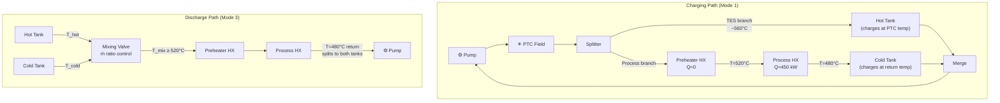

> [!IMPORTANT]
> During **charging**: the Hot Tank receives high-grade PTC output (~560°C) on the TES branch, while the Cold Tank receives the process return (~480°C) on the process branch. During **discharging**: both tanks discharge in parallel through a mixing valve. The process return (~480°C) splits proportionally back to both tank bottoms, pushing the thermoclines upward. The Preheater supplements only if T_mix < 520°C.

---

### 4.3 Series / Indirect — Full Layout

All components are in a **single series loop**. During charging, the HTF first serves the process, then the cooler return charges the TES via a coupling HX. No Splitter/Merge needed.

```mermaid
graph TD
    subgraph "Primary Loop (Charge Path)"
        P1["⚙ Pump 1"] --> PTC["☀ PTC Field"]
        PTC --> PH["Preheater HX<br/>(Auxiliary)"]
        PH -->|"T=520°C"| PR["Process HX<br/>Q=450 kW"]
        PR -->|"T=480°C"| CHX_H["Charge HX<br/>(hot side)"]
        CHX_H --> P1
    end

    subgraph "TES Secondary Loop (Charge)"
        P2["⚙ Pump 2"] --> PBTES["🔥 PBTES<br/>Packed Bed"]
        PBTES --> CHX_C["Charge HX<br/>(cold side)"]
        CHX_C --> P2
    end

    subgraph "TES Discharge Secondary Loop"
        P2D["⚙ Pump 2"] --> PBTES2["🔥 PBTES"]
        PBTES2 --> DHX_H["Discharge HX<br/>(hot side)"]
        DHX_H --> P2D
    end

    subgraph "Process Discharge Loop"
        DHX_C["Discharge HX<br/>(cold side)"] --> PH2["Preheater HX"]
        PH2 --> PR2["Process HX"]
        PR2 --> P1D["⚙ Pump 1"]
        P1D --> DHX_C
    end
```

---

### 4.4 Series / Direct — Full Layout

All components in a single series loop. The primary NaK flows directly **through** the packed beds (Hot Tank and Cold Tank) without any intermediate heat exchangers. In this direct configuration, the beds are modeled inside TESPy as `SimpleHeatExchanger` components (acting as "pipes").

The **Hot Tank** is placed **upstream** of the process (receiving PTC output at ~560°C), and the **Cold Tank** is placed **downstream** (receiving process return at ~480°C).

During discharge, to avoid the pressure drops and temperature control issues of series discharge, both tanks discharge **in parallel** via a **mixing valve**. This mixing valve and return split are solved **analytically (Option A)** rather than directly within the TESPy solver, keeping the network simple and robust.

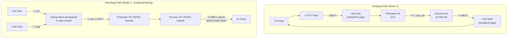

> [!IMPORTANT]
> **Coupling Boundary**: The coupling boundary in direct configurations is the TES **outlet temperature**. For Series/Direct Mode 1 charging, the outlet of the Hot Tank (`conn_ht_ph.T`) and the Cold Tank (`conn_10.T`) are set as boundary conditions in TESPy, with values derived iteratively from the 1D Schumann rock bed model. To prevent over-specification, the preheater outlet connection `conn_05` must **not** be set to a fixed 520°C, since the `Q=0` preheater constraint already forces `T_05 = conn_ht_ph.T`.

> [!NOTE]
> In Series/Direct charging, the Hot Tank is **upstream** of the process — it captures the full PTC output temperature. This is different from Series/Indirect where the TES is downstream of the process and only receives ~480°C fluid. This upstream placement is a key advantage of the 2-tank direct approach for the Series topology, as it enables the PTC to charge the Hot Tank at temperatures well above the process requirement.
---

## 5. Mode-by-Mode Diagrams

Below are the **active flow paths** for each mode. Only the components and connections that are operational are shown. Pumps are included where they drive flow.

### Notation

- Solid arrows = active flow
- Temperatures shown where set as boundary conditions
- `Q=450 kW` is the process heat demand

---

### 5.1 Mode 1 — Solar Charges TES + Serves Process

**When**: High irradiance, TES not full, PTC outlet hotter than TES top.

#### Mode 1 — Parallel / Indirect

The PTC output is split: one branch goes to process, the other charges the TES via the Charge HX. Two pumps: primary loop + TES secondary loop.

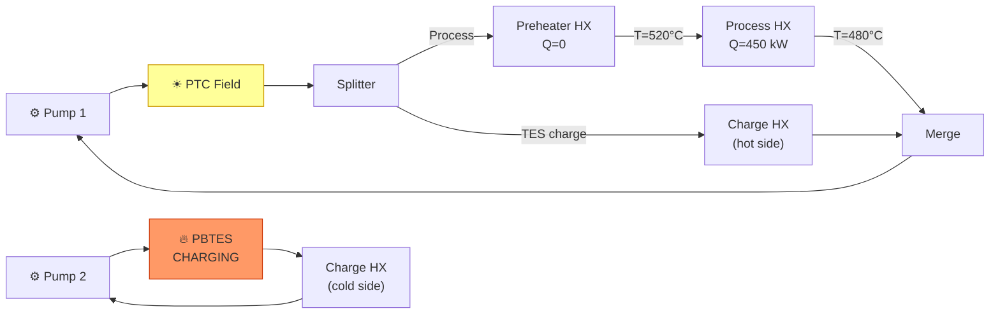

#### Mode 1 — Parallel / Direct

Split flow: one branch charges the **Hot Tank** at PTC outlet temperature (~560°C), the other serves the process and charges the **Cold Tank** with the process return (~480°C). Single pump.

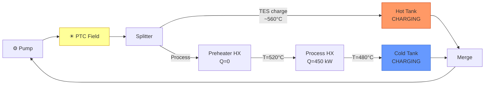

> [!TIP]
> In Parallel/Direct Mode 1, the Hot Tank receives the **full PTC outlet temperature** (~560°C) on its branch, while the Cold Tank receives the **process return** (~480°C) on the other branch. Both tanks charge simultaneously at their respective temperature levels.

#### Mode 1 — Series / Indirect

The HTF flows in series: PTC → Preheater → Process → Charge HX → back. The TES receives the **post-process fluid at ~480°C** (cooler than Parallel). Two pumps.

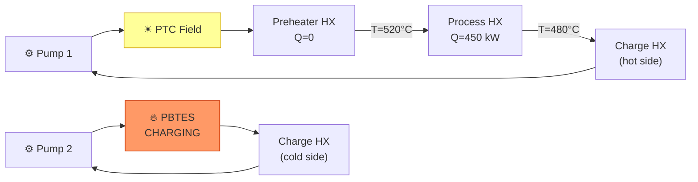

> [!NOTE]
> In Series Mode 1, the TES receives **cooler fluid** (post-process at ~480°C) compared to Parallel Mode 1 where it receives fluid directly from the PTC (~560°C). This is the fundamental thermodynamic trade-off between topologies.

#### Mode 1 — Series / Direct

HTF flows in series: PTC → **Hot Tank** (charges at PTC temp) → Preheater → Process → **Cold Tank** (charges at process return temp). Single pump. 

Both tanks are modeled directly in the primary loop as `SimpleHeatExchanger` components. 

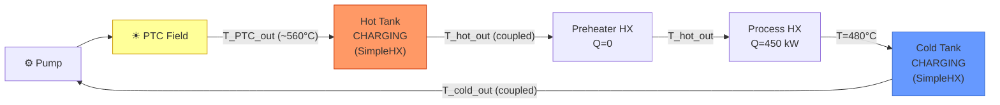

> [!IMPORTANT]
> **Direct Coupling Rules**:
> 1. **T_05 / Preheater outlet**: Unlike other modes, the preheater outlet temperature `T_05` is **not** set to a fixed 520°C in TESPy. Doing so would cause over-specification, because `Q_preheater = 0` already requires `T_05` to equal `T_hot_out` (which is set by the Schumann model).
> 2. **Boundary Conditions**: The Hot Tank outlet (`conn_ht_ph.T`) and Cold Tank outlet (`conn_10.T`) are set directly to the Schumann model bottom temperatures (`hot_tes.tout` and `cold_tes.tout`).
> 3. **PTC Area**: The PTC area is fixed (not variable), and the flow rates and PTC outlet temperature are calculated by TESPy.

> [!NOTE]
> Unlike Series/Indirect (where the TES is downstream of the process at ~480°C), Series/Direct places the **Hot Tank upstream** of the process to capture the full PTC output temperature. The Cold Tank downstream captures the process return. This means both tanks in Series/Direct charge at the **same temperature levels** as in Parallel/Direct.

---

### 5.2 Mode 2 — Solar to Process Only (TES Standby)

**When**: Sufficient irradiance for process, but TES is full or charging is not viable.

Simple loop: PTC → Preheater → Process HX → back. No TES interaction. **Identical for all four configurations.** Single pump.

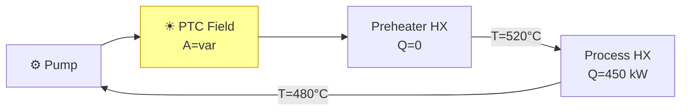

> [!TIP]
> In Mode 2, the PTC aperture area is set to `A='var'` (variable), meaning TESPy calculates the required aperture to exactly meet the process demand at the current irradiance. This is the design-point sizing mechanism.

---

### 5.3 Mode 3 — TES Discharge to Process

**When**: Low or no irradiance, TES has sufficient charge (SoC > 0.10, T_top in 500–580°C range).

The PTC is **inactive**. Hot fluid from the TES supplies the process. The topology axis (Parallel/Series) is irrelevant since there is no PTC. The Preheater supplements heat if TES outlet is not hot enough.

#### Mode 3 — Indirect (both Parallel and Series)

The TES secondary loop pushes hot HTF through the Discharge HX to heat the process loop. Two pumps: process loop + TES secondary.

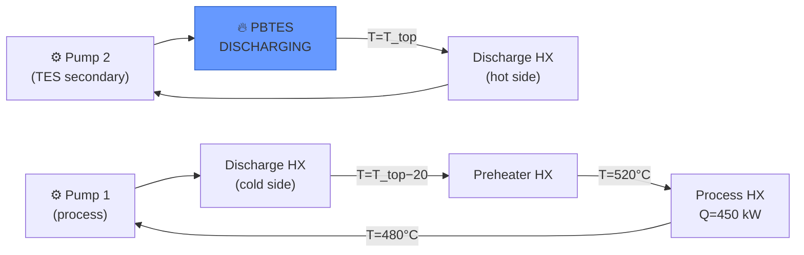

> [!IMPORTANT]
> The Discharge HX outlet temperature on the process side is set as T_top − 20°C (the TTD constraint). The TES outlet temperature is updated iteratively by the Schumann model until convergence.

#### Mode 3 — Direct (both Parallel and Series)

During discharge, both tanks discharge **in parallel** through a mixing valve to provide active temperature regulation to ≥520°C. 

To maintain network simplicity and prevent solver divergence, the mixing valve and split physics are modeled **analytically (Option A)** rather than placing splitter/merge components inside the TESPy solver:

1. **Analytical Mixing**: At each timestep, we read the outlet temperatures `T_hot` and `T_cold` from the Schumann models of the Hot Tank and Cold Tank respectively.
2. **Mass Flow Split**: The mixing ratio `r = m_hot / m_cold` is calculated analytically to hit `T_target = 520°C`:
   ```
   r = (T_target − T_cold) / (T_hot − T_target)
   ```
   Using the total process flow rate `m_total` (determined by process demand), the individual mass flows are:
   ```
   m_hot = r / (1 + r) * m_total
   m_cold = 1 / (1 + r) * m_total
   ```
3. **Auxiliary Shortfall**: The mixed temperature is computed as `T_mix = (m_hot·T_hot + m_cold·T_cold) / m_total`. If `T_mix < 520°C`, the supplemental auxiliary heating (Preheater HX) is computed as `Q_preheater = m_total · cp · (520 − T_mix)`.
4. **TESPy Network**: TESPy only solves the simple process-only loop (identical to Mode 4), using the pre-calculated `Q_preheater` as a constraint. The tanks are completely removed from the TESPy network for this mode.
5. **TES Updates**: Both Schumann models are updated independently at their respective analytical mass flows `m_hot` and `m_cold`.

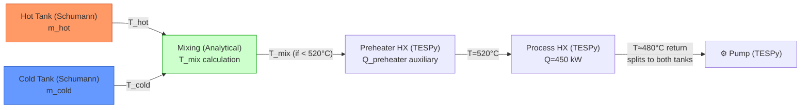

> [!IMPORTANT]
> **Control Strategy**: 
> - When `T_hot ≥ 520°C` and `T_cold ≥ 520°C`, the controller favors the Cold Tank to preserve Hot Tank energy.
> - When `T_cold < 520°C`, more flow is drawn from the Hot Tank to hit `T_mix = 520°C`.
> - When `T_hot < 520°C` (both tanks depleted), the Preheater supplements the remaining heating load. This extends the useful discharge period and ensures process heat demands are met robustly.

---

### 5.4 Mode 4 — Standby / Auxiliary Heater

**When**: No sun, TES exhausted (SoC < 0.05).

Minimal loop: Preheater (auxiliary heater) supplies all heat, Process HX delivers to zinc pool. **No PTC, no TES interaction.** Identical for all configurations. Single pump.

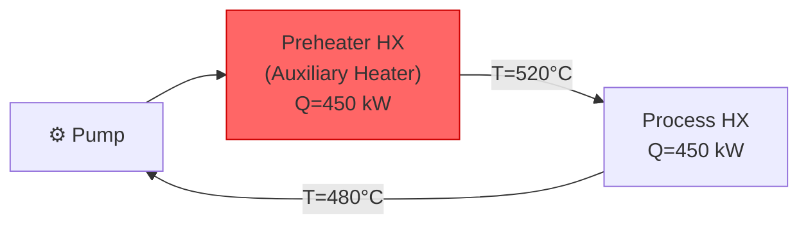

> [!NOTE]
> The Preheater HX in Mode 4 acts as an **auxiliary heater** (gas-fired or electric), supplying whatever heat is needed to maintain the zinc pool temperature.

---

### 5.5 Mode 5 — High-Temperature Solar Charging (Parallel Only)

**When**: High irradiance, T_tes_top > 520°C, SoC < 0.90. **Parallel topology only.**

This mode uses a dedicated **High-Temperature Charge HX** that is physically separate from the regular Charge HX used in Mode 1. They are installed **in parallel** in the plant. In other modes, the HTF bypasses the High-T HX through a parallel pipe.

The primary loop flow is: PTC → **High-T Charge HX** → Preheater → Process HX → back to PTC. The TES secondary loop circulates through the cold side of the High-T HX. The TES receives the **hottest fluid** from the PTC outlet before any heat is extracted for the process.

#### Mode 5 — Parallel / Indirect

Two pumps: primary + TES secondary.

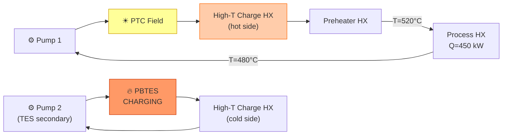

#### Mode 5 — Parallel / Direct

Single pump. PTC output flows directly into the **Hot Tank** (no HX needed), then continues to Preheater and Process. The Cold Tank is bypassed in this mode.

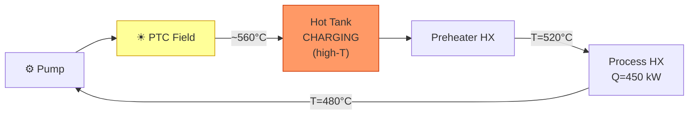

> [!NOTE]
> In direct Mode 5, the PTC output goes directly to the Hot Tank (no High-T Charge HX needed since there is no secondary loop). This is equivalent to Mode 1 Series/Direct without the Cold Tank. The Cold Tank is bypassed because Mode 5 focuses on high-temperature charging of the Hot Tank only.

---

### 5.6 Mode 6 — Solar Charges TES + Process (Decoupled, Parallel Only)

**When**: Moderate irradiance, TES is cold (SoC < 0.40, T_top < 470°C). This mode is "sticky" — it persists until SoC reaches 0.80. **Parallel topology only.**

Two **completely independent cycles** operate simultaneously, each with its own pump:
- **Cycle A** (Solar → TES): PTC output goes entirely to charging the TES
- **Cycle B** (Process): Preheater acts as auxiliary heater, supplying all process heat independently

#### Mode 6 — Parallel / Indirect

Two pumps (one per cycle) + TES secondary pump = 3 active pumps.

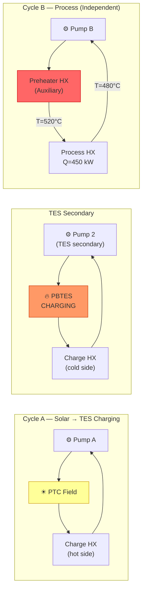

#### Mode 6 — Parallel / Direct

Two pumps (one per cycle). Cycle A charges the **Hot Tank** with PTC output. Cycle B runs the process on auxiliary and charges the **Cold Tank** with the process return.

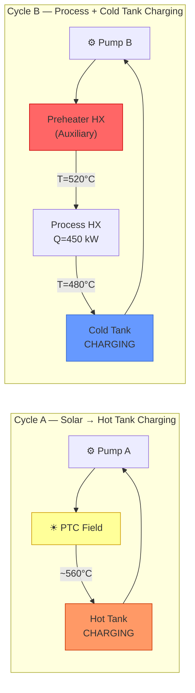

> [!TIP]
> In direct Mode 6, both tanks charge simultaneously from separate thermal sources: the Hot Tank from the PTC (high-grade, ~560°C) and the Cold Tank from the process return (lower-grade, ~480°C). This maximizes energy capture into both tanks while keeping the cycles completely independent.

> [!WARNING]
> **Mode 6 Parallel design currently fails** in TESPy with "too many parameters: 13 required, 14 supplied". This is a known Phase C issue. At runtime, Mode 6 falls back to Mode 4 when this occurs.

---

## 6. TES Coupling Iteration

The PBTES packed bed is solved by a 1D Schumann model which is **not inside** the TESPy solver. The solver therefore performs a quasi-steady coupling loop at each timestep.

### 6.1 Indirect Configuration Coupling
In indirect configurations, the primary NaK loop is decoupled from the TES secondary loop by a physical heat exchanger (HX). TESPy solves the primary loop using a guessed secondary inlet temperature, and the Schumann model updates the rock bed using the resulting HX hot-side temperature. The system iterates sequentially until the heat transfer rates and temperatures converge:


### 6.2 Direct Configuration Coupling (Two-Tank, Mode 1)
In the Series/Direct configuration, there is no decoupling HX. The primary NaK flows directly through both the Hot Tank and Cold Tank beds, which are modeled in TESPy as simple pipe components (`SimpleHeatExchanger`). The coupling boundary variables are the outlet temperatures of both tanks, which are set as boundary conditions on the primary connections `conn_ht_ph.T` and `conn_10.T`.

The direct coupling loop iterates as follows:
1. **Initial guess**: The Hot Tank and Cold Tank outlet temperatures are initialized to their current bottom-of-bed temperatures (`hot_tes.profile[-1]` and `cold_tes.profile[-1]`).
2. **TESPy solve**: TESPy solves the primary closed loop, calculating the primary mass flow rate `m` and the Hot Tank inlet temperature `T_02` (PTC outlet). The Cold Tank inlet temperature is fixed to the process return temperature (`480°C`).
3. **Schumann update**: Both the Hot Tank and Cold Tank Schumann models are stepped with their respective inlet temperatures (`T_in_hot = T_02`, `T_in_cold = 480°C`) and the common mass flow rate `m`.
4. **Boundary update**: The connections `conn_ht_ph.T` and `conn_10.T` in TESPy are updated with the new bottom temperatures (`hot_tes.tout` and `cold_tes.tout`).
5. **Convergence check**: Repeat steps 2-4 until both outlet temperatures converge within tolerance (|ΔT| < 1e-3 °C).
6. **Time step advance**: Advance the simulation timestep, saving the converged rock bed temperature profiles.

### 6.3 Flow Direction and Nodes
* **Charging (Top to Bottom)**: Hot fluid enters at the **top** of the packed bed and cold fluid exits at the **bottom**. The outlet temperature is `tout = profile[-1]` (bottom node).
* **Discharging (Bottom to Top)**: Cold fluid enters at the **bottom** and hot fluid exits at the **top**. The outlet temperature is `tout = profile[0]` (top node). During discharging, the profile array is reversed for the Schumann model execution.

### Discharge Temperature Control (Direct Configuration Only)

During discharge (Mode 3) in direct configurations, both tanks release hot fluid from their tops **in parallel**. A mixing valve blends the two streams to control the process inlet temperature.

**Mixing equation:**

```
T_mix = (ṁ_hot × T_hot + ṁ_cold × T_cold) / (ṁ_hot + ṁ_cold)
```

where:
- `T_hot` = Hot Tank outlet temperature (from top)
- `T_cold` = Cold Tank outlet temperature (from top)
- `ṁ_hot`, `ṁ_cold` = mass flow rates from each tank (controlled by the mixing valve)
- `T_mix` ≥ 520°C (target process inlet temperature)

**Required mass flow ratio** (to achieve target temperature):

```
ṁ_hot / ṁ_cold = (T_target − T_cold) / (T_hot − T_target)
```

**Control logic:**

| Condition | Strategy |
|-----------|----------|
| T_hot ≥ 520°C and T_cold ≥ 520°C | Mix both; favor Cold Tank to preserve Hot Tank energy |
| T_hot ≥ 520°C but T_cold < 520°C | Increase ṁ_hot / ṁ_cold ratio to reach T_mix = 520°C |
| T_hot < 520°C | Preheater supplements; both tanks still discharge to reduce auxiliary load |
| Both tanks depleted (SoC ≈ 0) | Switch to Mode 4 (auxiliary only) |

> [!TIP]
> The 2-tank mixing strategy **extends the useful discharge period**. Even when one tank's thermocline degrades and its outlet drops below T_target, blending with the other tank's output maintains the target temperature longer than a single-tank system could. The Preheater only activates as a last resort when neither tank alone can sustain T_target.

---

## 7. Summary Matrix: Which Components are Active per Mode

| Component | M1 | M2 | M3 | M4 | M5 | M6-Par |
|-----------|:--:|:--:|:--:|:--:|:--:|:------:|
| PTC Field | ✓ | ✓ | — | — | ✓ | ✓ |
| Preheater HX | Q=0 | Q=0 | ✓ | ✓ (aux) | ✓ | ✓ (aux) |
| Process HX | ✓ | ✓ | ✓ | ✓ | ✓ | ✓ |
| Charge HX† | ✓ | — | — | — | — | ✓ |
| High-T Charge HX† | — | — | — | — | ✓ | — |
| Discharge HX† | — | — | ✓ | — | — | — |
| Hot Tank‡ | charge | — | discharge | — | charge | charge |
| Cold Tank‡ | charge | — | discharge | — | — | charge |
| Mixing Valve‡ | — | — | ✓ | — | — | — |
| Splitter / Merge | ✓* | — | — | — | — | — |
| PBTES | charge | — | discharge | — | charge | charge |
| Pump 1 (primary) | ✓ | ✓ | ✓ | ✓ | ✓ | ✓ (×2) |
| Pump 2 (secondary)† | ✓ | — | ✓ | — | ✓ | ✓ |

*Splitter/Merge only in Parallel Mode 1.
†Indirect configurations only.
‡Direct configurations only.

---

## 8. Pump Summary per Mode and Configuration

| Mode | Parallel/Indirect | Parallel/Direct | Series/Indirect | Series/Direct |
|------|:-----------------:|:---------------:|:---------------:|:-------------:|
| 1 | 2 pumps (primary + secondary) | 1 pump | 2 pumps (primary + secondary) | 1 pump |
| 2 | 1 pump | 1 pump | 1 pump | 1 pump |
| 3 | 2 pumps (process + secondary) | 1 pump | 2 pumps (process + secondary) | 1 pump |
| 4 | 1 pump | 1 pump | 1 pump | 1 pump |
| 5 | 2 pumps (primary + secondary) | 1 pump | N/A | N/A |
| 6 | 3 pumps (solar cycle + process cycle + secondary) | 2 pumps (solar cycle + process cycle) | N/A | N/A |

---

## 9. Connection Label Reference

| Label | From → To | Used in Modes |
|-------|-----------|---------------|
| `conn_01` | Pump → PTC | 1, 2, 5, 6 |
| `conn_02` | PTC → Splitter (Par) or PTC → Preheater (Ser) or PTC → ChargeHX (M5/M6) | 1, 2, 5, 6 |
| `conn_04` | Splitter → Preheater (Par M1) or DischargeHX → Preheater (M3) or Pump → Preheater (M4) or CC2 → Preheater (M6-Par) | 1, 3, 4, 6 |
| `conn_05` | Preheater → Process HX (T=520°C) | All |
| `conn_06` | Process HX → next component (T=480°C, p=50 bar) | All |
| `conn_08` | Merge → Pump (Parallel M1 only) | 1 |
| `conn_09` | Splitter → Charge HX (Parallel M1 only) | 1 |
| `conn_10` | Charge HX → Merge (Par M1) or ChargeHX → Pump (Ser) or HighT-HX → Preheater (M5) | 1, 5, 6 |
| `conn_11` | Pump → Discharge HX cold side (M3) | 3 |
| `conn_13` | PBTES → Charge HX cold side (indirect only) | 1, 5, 6 |
| `conn_14` | Charge HX cold side → PBTES (indirect only) | 1, 5, 6 |
| `conn_15` | PBTES → Discharge HX hot side (indirect only) | 3 |
| `conn_16` | Discharge HX hot side → PBTES (indirect only) | 3 |
