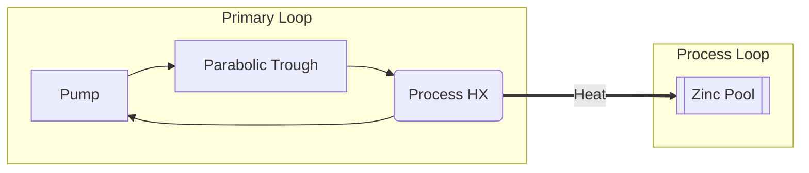
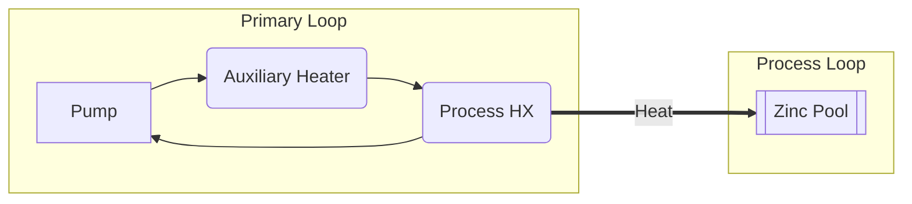
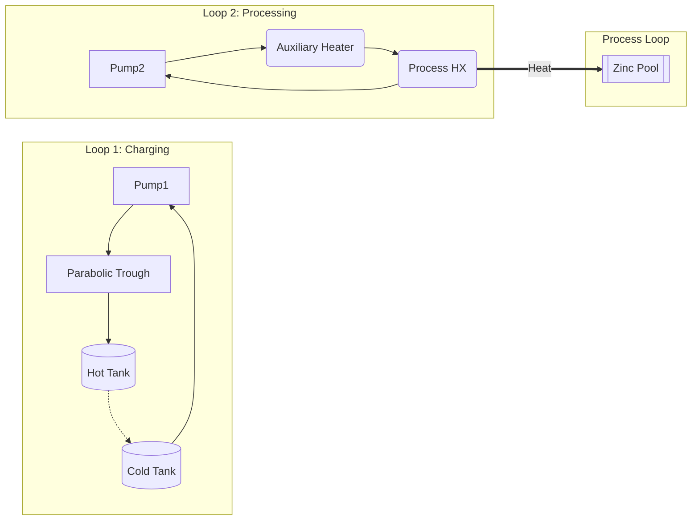

# PBTES Solar Plant: Layouts, Modes, and Configurations

This document provides a comprehensive overview of the plant configurations, the distinction between different topologies, and how the operating modes dictate fluid routing.

---

## 1. Topologies & Tank Configurations

The project matrix explores four distinct architectural variants, formed by combining two routing **Topologies** (Parallel vs Series) and two **Tank Configurations** (Indirect vs Direct).

### 1.1 Parallel vs. Series (Topologies)
This defines how the Solar Field (PTC) interfaces with the Process Heat Exchanger and the Thermal Energy Storage.

- **Parallel Topology**: The hot fluid exiting the PTC encounters a splitter. The flow is divided into parallel branches depending on the mode.
- **Series Topology**: The hot fluid from the PTC travels through the system in a single series loop, passing sequentially through the components.

### 1.2 Indirect vs. Direct (Tank Configurations)
This defines whether the primary Heat Transfer Fluid (HTF) physically enters the storage tanks.

- **Indirect Config (Baseline)**: The Primary Loop (PTC and Process) is completely isolated from the Secondary Loop (TES). They exchange heat via two dedicated heat exchangers: `Charge_TES_HX` and `Discharge_TES_HX`.
- **Direct Config (2-Tank Approach)**: There is only one fluid loop. The primary HTF (NaK) circulates directly through the PBTES and the process. The PBTES is configured using a **2-tank system** (Hot Tank and Cold Tank) for storage. The heat exchangers are removed (represented as simple virtual pipes in the model) to eliminate the temperature approach (TTD) penalty.

---

## 2. Operating Modes Summary

The simulation utilizes six distinct operating modes depending on the current Solar Irradiance (DNI) and the TES State of Charge (SoC).

| Mode | Name | Description | Active Components |
|------|------|-------------|-------------------|
| **1** | Pure Charging | **Solar charges TES.** Used when process demand is off or fully met, routing all solar heat to the TES. | PTC, Charge TES HX |
| **2** | Solar to Process | **Solar serves process only.** Solar irradiance matches process demand; TES is inactive. | PTC, Process HX |
| **3** | TES Discharge | **TES discharging.** Solar is insufficient/off. TES discharges heat to the process loop. | Discharge TES HX, Process HX |
| **4** | Auxiliary Heater Only | **Auxiliary firing.** Solar is off and TES is depleted. The Auxiliary Heater provides 100% of process heat. | Aux Heater, Process HX |
| **5** | High-Temperature Charging | **High-T Charging + Process.** A special series mode that forces fluid from PTC → Charge TES HX (highest temp) → Additional HX (Preheater/Aux) → Process HX. This ensures the TES charges at the highest possible temperature. | PTC, Charge TES HX, Aux Heater, Process HX |
| **6** | Special Cold-Tank Charge | **Two Independent Loops.** A special mode used when the tank is too cold. All PTC energy is delivered to the PBTES in one loop, while the Auxiliary Heater independently serves the process in a separate loop. | PTC, Charge TES HX, Aux Heater, Process HX |

---

## 3. Diagrams per Operating Mode (Parallel / Indirect Baseline)

Below are the fluid routing diagrams for each of the 6 operating modes, assuming the baseline Parallel/Indirect architecture.

### Mode 1: Pure Charging
```mermaid
graph LR
    subgraph Primary Loop
        Pump --> PTC[Parabolic Trough]
        PTC --> CHX(Charge TES HX)
        CHX --> Pump
    end
    subgraph Secondary Loop (TES)
        CHX -.->|Charge| TES[(Packed Bed)]
        TES -.->|Cold Return| CHX
    end
```

### Mode 2: Solar to Process (TES Standby)


### Mode 3: TES Discharge
```mermaid
graph LR
    subgraph Primary Loop
        Pump --> DHX(Discharge TES HX)
        DHX --> PHX(Process HX)
        PHX --> Pump
    end
    subgraph Secondary Loop (TES)
        TES[(Packed Bed)] -.->|Discharge| DHX
        DHX -.->|Cold Return| TES
    end
    subgraph Process Loop
        PHX ===>|Heat| ZP[[Zinc Pool]]
    end
```

### Mode 4: Auxiliary Heater Only


### Mode 5: High-Temperature Charging
*Special series routing to ensure TES gets the hottest fluid.*
```mermaid
graph LR
    subgraph Primary Loop
        Pump --> PTC[Parabolic Trough]
        PTC --> CHX(Charge TES HX)
        CHX --> AUX(Additional HX / Aux Heater)
        AUX --> PHX(Process HX)
        PHX --> Pump
    end
    subgraph Secondary Loop (TES)
        CHX -.->|High-T Charge| TES[(Packed Bed)]
        TES -.->|Cold Return| CHX
    end
    subgraph Process Loop
        PHX ===>|Heat| ZP[[Zinc Pool]]
    end
```

### Mode 6: Special Cold-Tank Charge
*Two completely independent loops.*
```mermaid
graph LR
    subgraph Loop 1: Charging
        Pump1 --> PTC[Parabolic Trough]
        PTC --> CHX(Charge TES HX)
        CHX --> Pump1
    end
    subgraph Loop 2: Processing
        Pump2 --> AUX(Auxiliary Heater)
        AUX --> PHX(Process HX)
        PHX --> Pump2
    end
    
    subgraph Secondary Loop (TES)
        CHX -.->|Charge| TES[(Packed Bed)]
        TES -.->|Cold Return| CHX
    end
    subgraph Process Loop
        PHX ===>|Heat| ZP[[Zinc Pool]]
    end
```

---

## 4. The Direct Approach (2-Tank System)

In the Direct configuration, the intermediate heat exchangers (`Charge_TES_HX` and `Discharge_TES_HX`) are eliminated. The same primary Heat Transfer Fluid circulates through the solar field, the process, and the storage tanks. Storage is handled via a **2-Tank system** (a Hot Tank and a Cold Tank).

### Direct Mode 5 (High-Temperature Charging Example)
```mermaid
graph LR
    subgraph Single Loop (NaK)
        Pump --> PTC[Parabolic Trough]
        
        PTC --> HT[(Hot Tank)]
        HT -.-> CT[(Cold Tank)]
        CT --> AUX(Additional HX / Aux Heater)
        AUX --> PHX(Process HX)
        PHX --> Pump
    end
    
    subgraph Process Loop
        PHX ===>|Heat| ZP[[Zinc Pool]]
    end
```

### Direct Mode 6 (Special Cold-Tank Charge Example)

