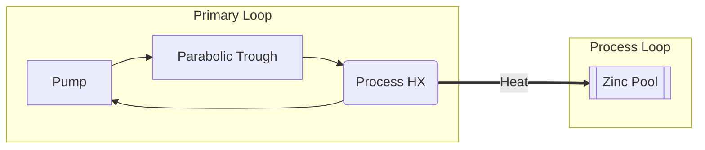
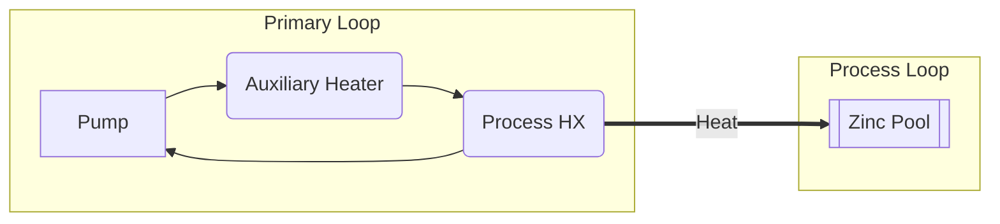
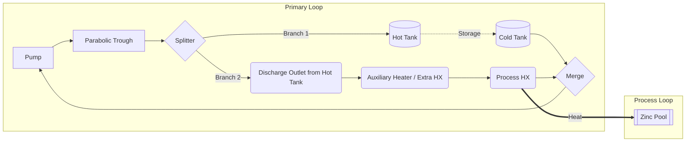
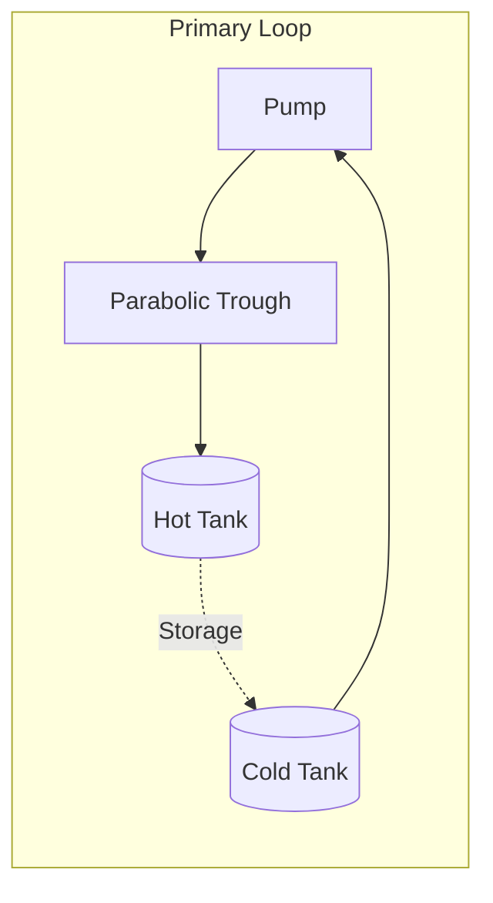
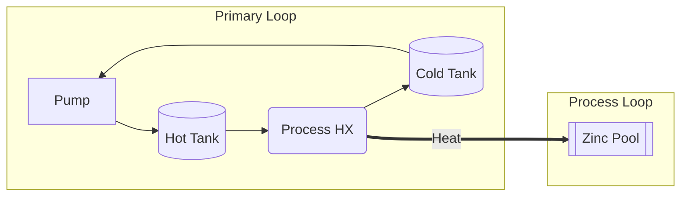
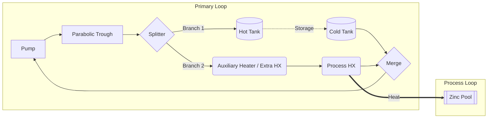
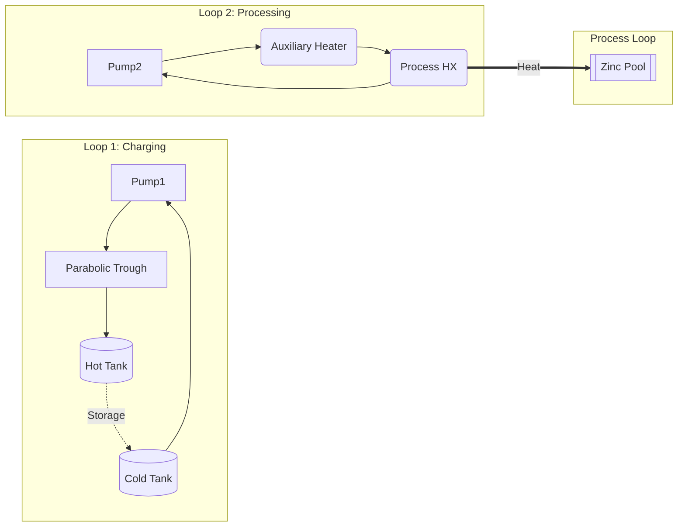

# PBTES Solar Plant: Layouts and Operating Modes

This document details the exact fluid routing for the 6 operating modes in both the **Indirect Parallel** and **Direct Parallel** architectures. 

*Note: In the Direct architecture, the Packed Bed Thermal Energy Storage (PBTES) is implemented as a 2-Tank system (Hot Tank and Cold Tank) directly circulating the primary HTF.*

---

## 1. Indirect Parallel Architecture

In the Indirect configuration, the primary NaK loop is isolated from the TES loop via dedicated heat exchangers (`Charge TES HX` and `Discharge TES HX`).

### 1.0 Complete Diagram (Indirect Parallel)
Shows all possible components and connections.
```mermaid
graph LR
    subgraph Primary Loop
        Pump --> PTC[Parabolic Trough]
        PTC --> SP{Splitter}
        
        %% Charging Branch
        SP -->|Branch 1| CHX(Charge TES HX)
        
        %% Process Branch
        SP -->|Branch 2| DHX(Discharge TES HX)
        DHX --> AUX(Auxiliary Heater / Extra HX)
        AUX --> PHX(Process HX)
        
        PHX --> MG{Merge}
        CHX --> MG
        MG --> Pump
    end
    
    subgraph Secondary Loop (TES)
        CHX -.->|Charge| TES[(Packed Bed)]
        TES -.->|Discharge| DHX
        DHX -.->|Cold Return| TES
        TES -.->|Cold Return| CHX
    end
    
    subgraph Process Loop
        PHX ===>|Heat| ZP[[Zinc Pool]]
    end
```

### 1.1 Mode 1: Pure Charging
Process is off or bypassed. All solar heat goes to the TES.
```mermaid
graph LR
    subgraph Primary Loop
        Pump --> PTC[Parabolic Trough]
        PTC --> CHX(Charge TES HX)
        CHX --> Pump
    end
    subgraph Secondary Loop (TES)
        CHX -.->|Charge| TES[(Packed Bed)]
        TES -.->|Cold Return| CHX
    end
```

### 1.2 Mode 2: Solar to Process (TES Standby)
Solar irradiance matches process demand. TES is inactive.


### 1.3 Mode 3: TES Discharge
Solar is off/insufficient. TES secondary loop discharges heat to the primary process branch.
```mermaid
graph LR
    subgraph Primary Loop
        Pump --> DHX(Discharge TES HX)
        DHX --> PHX(Process HX)
        PHX --> Pump
    end
    subgraph Secondary Loop (TES)
        TES[(Packed Bed)] -.->|Discharge| DHX
        DHX -.->|Cold Return| TES
    end
    subgraph Process Loop
        PHX ===>|Heat| ZP[[Zinc Pool]]
    end
```

### 1.4 Mode 4: Auxiliary Heater Only
Solar is off and TES is empty. Auxiliary Heater fires to meet 100% of demand.


### 1.5 Mode 5: High-Temperature Charging (Parallel)
The extra HX (Aux Heater) is in parallel with the Charge HX. Flow from the PTC splits to charge the TES and serve the process simultaneously.
```mermaid
graph LR
    subgraph Primary Loop
        Pump --> PTC[Parabolic Trough]
        PTC --> SP{Splitter}
        
        SP -->|Branch 1| CHX(Charge TES HX)
        SP -->|Branch 2| AUX(Auxiliary Heater / Extra HX)
        AUX --> PHX(Process HX)
        
        PHX --> MG{Merge}
        CHX --> MG
        MG --> Pump
    end
    
    subgraph Secondary Loop (TES)
        CHX -.->|Charge| TES[(Packed Bed)]
        TES -.->|Cold Return| CHX
    end
    
    subgraph Process Loop
        PHX ===>|Heat| ZP[[Zinc Pool]]
    end
```

### 1.6 Mode 6: Special Cold-Tank Charge
Used when the tank is too cold. All PTC energy is delivered to the TES, while the Auxiliary Heater independently serves the process in two completely isolated loops.
```mermaid
graph LR
    subgraph Loop 1: Charging
        Pump1 --> PTC[Parabolic Trough]
        PTC --> CHX(Charge TES HX)
        CHX --> Pump1
    end
    subgraph Loop 2: Processing
        Pump2 --> AUX(Auxiliary Heater)
        AUX --> PHX(Process HX)
        PHX --> Pump2
    end
    
    subgraph Secondary Loop (TES)
        CHX -.->|Charge| TES[(Packed Bed)]
        TES -.->|Cold Return| CHX
    end
    subgraph Process Loop
        PHX ===>|Heat| ZP[[Zinc Pool]]
    end
```

---

## 2. Direct Parallel Architecture

In the Direct configuration, the intermediate heat exchangers are removed. The primary NaK fluid circulates directly through the storage, which is implemented as a 2-Tank system (Hot Tank and Cold Tank).

### 2.0 Complete Diagram (Direct Parallel)


### 2.1 Mode 1: Pure Charging


### 2.2 Mode 2: Solar to Process (TES Standby)


### 2.3 Mode 3: TES Discharge
Fluid is drawn from the Hot Tank to serve the process, returning to the Cold Tank.


### 2.4 Mode 4: Auxiliary Heater Only


### 2.5 Mode 5: High-Temperature Charging (Parallel)
The extra HX is in parallel with the 2-Tank charging inlet.


### 2.6 Mode 6: Special Cold-Tank Charge
Two independent loops: one for charging the tanks, one for the process.

