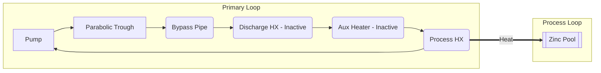
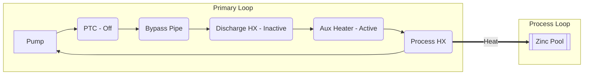
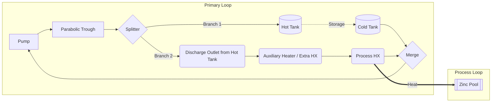
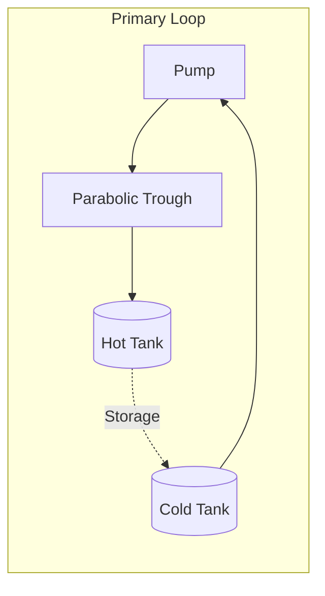
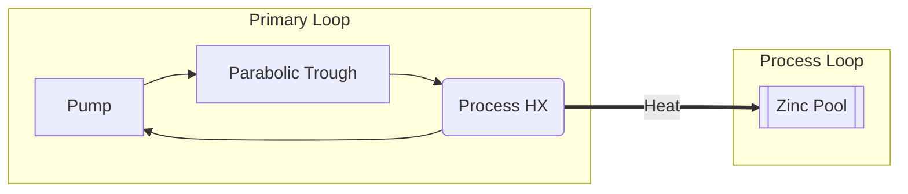
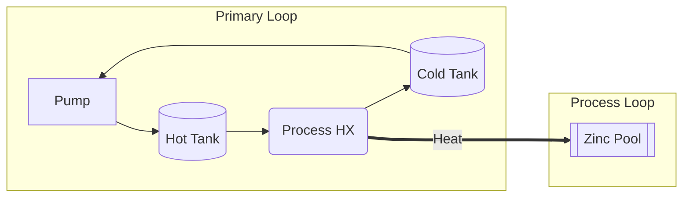
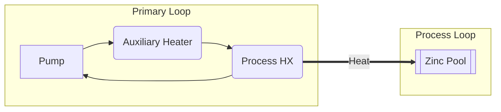
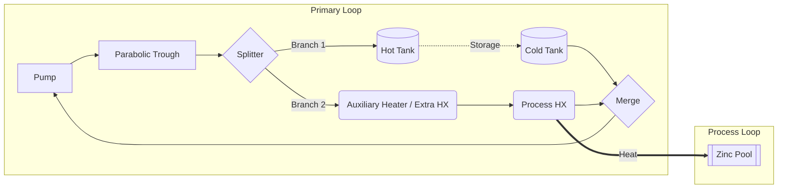
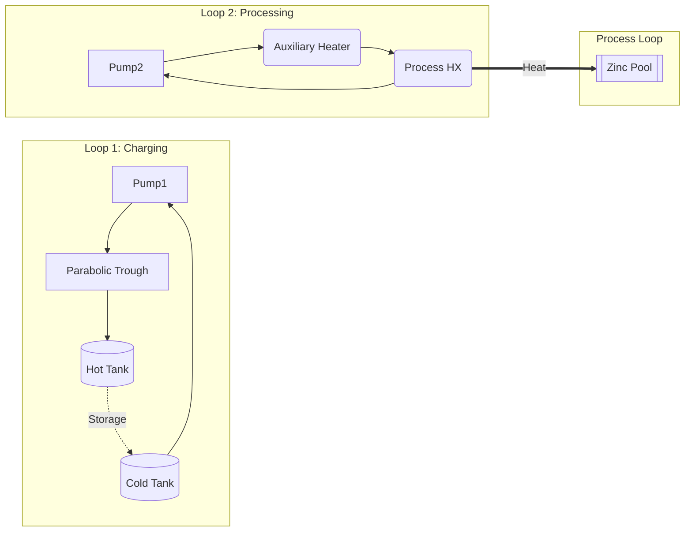

# PBTES Solar Plant: Layouts and Operating Modes

This document details the exact fluid routing for the operating modes in the **Indirect Parallel** architecture. *(Note: Direct Parallel architecture diagrams are pending revision and will be added later).*

---

## 1. Indirect Parallel Architecture

In the Indirect configuration, the primary NaK loop is physically isolated from the TES loop. Heat is transferred via dedicated heat exchangers. The layout features three distinct heat exchangers interacting with the TES, plus an Auxiliary Heater:
- **Extra HX (High-Temp Charge)**: Located on the main line from the PTC, in parallel with a bypass pipe. Used exclusively in Mode 5.
- **Charge HX (Normal Charge)**: Located on a parallel branch after the main splitter.
- **Discharge HX**: Located on the process branch, before the Auxiliary Heater.
- **Auxiliary Heater**: Located on the process branch, used to top-up heat when solar/TES is insufficient.

### 1.0 Complete Diagram (Indirect Parallel)
Shows all physical components and piping connections in the system.
```mermaid
graph LR
    subgraph Primary Loop (NaK)
        Pump --> PTC[Parabolic Trough]
        
        %% Extra HX vs Bypass Pipe
        PTC --> SP_A{Valve Splitter}
        SP_A -->|Bypass| PIPE(Bypass Pipe)
        SP_A -->|Mode 5 Only| EHX(Extra HX)
        PIPE --> MG_A{Valve Merge}
        EHX --> MG_A
        
        %% Main Splitter
        MG_A --> SP_B{Main Splitter}
        
        %% Charging Branch
        SP_B -->|Branch 1| CHX(Charge HX)
        
        %% Process Branch
        SP_B -->|Branch 2| DHX(Discharge HX)
        DHX --> AUX(Auxiliary Heater)
        AUX --> PHX(Process HX)
        
        PHX --> MG_B{Main Merge}
        CHX --> MG_B
        MG_B --> Pump
    end
    
    subgraph Secondary Loop (TES)
        EHX -.->|High-T Charge| TES[(Packed Bed)]
        CHX -.->|Normal Charge| TES
        TES -.->|Discharge| DHX
    end
    
    subgraph Process Loop
        PHX ===>|Heat| ZP[[Zinc Pool]]
    end
```

### 1.1 Mode 1: Pure Charging
Flow bypasses the Extra HX via the pipe. At the main splitter, flow is routed to the Charge HX. The process branch may receive minimal flow but no heat is exchanged.
```mermaid
graph LR
    subgraph Primary Loop
        Pump --> PTC[Parabolic Trough]
        PTC --> PIPE(Bypass Pipe)
        PIPE --> SP_B{Main Splitter}
        SP_B --> CHX(Charge HX)
        CHX --> Pump
    end
    subgraph Secondary Loop (TES)
        CHX -.->|Charge| TES[(Packed Bed)]
        TES -.->|Cold Return| CHX
    end
```

### 1.2 Mode 2: Solar to Process (TES Standby)
Flow bypasses the Extra HX via the pipe. At the main splitter, all flow is routed to the Process branch.


### 1.3 Mode 3: TES Discharge
Solar is off/insufficient. Flow bypasses the Extra HX. The TES secondary loop discharges heat to the primary fluid via the Discharge HX, which then serves the process.
```mermaid
graph LR
    subgraph Primary Loop
        Pump --> PTC(PTC - Low/Off)
        PTC --> PIPE(Bypass Pipe)
        PIPE --> DHX(Discharge HX - Active)
        DHX --> AUX(Aux Heater - Inactive)
        AUX --> PHX(Process HX)
        PHX --> Pump
    end
    subgraph Secondary Loop (TES)
        TES[(Packed Bed)] -.->|Discharge| DHX
        DHX -.->|Cold Return| TES
    end
    subgraph Process Loop
        PHX ===>|Heat| ZP[[Zinc Pool]]
    end
```

### 1.4 Mode 4: Auxiliary Heater Only
Solar is off and TES is empty. Flow bypasses the Extra HX. The Auxiliary Heater fires to meet 100% of demand.


### 1.5 Mode 5: High-Temperature Charging
The bypass pipe is closed. **All flow goes through the Extra HX** to charge the TES at the highest possible temperature directly from the PTC. The fluid then continues through the process branch (Auxiliary heater is off). The regular Charge HX branch is closed.
```mermaid
graph LR
    subgraph Primary Loop
        Pump --> PTC[Parabolic Trough]
        PTC --> EHX(Extra HX - Active)
        EHX --> DHX(Discharge HX - Inactive)
        DHX --> AUX(Aux Heater - Inactive)
        AUX --> PHX(Process HX)
        PHX --> Pump
    end
    subgraph Secondary Loop (TES)
        EHX -.->|High-T Charge| TES[(Packed Bed)]
        TES -.->|Cold Return| EHX
    end
    subgraph Process Loop
        PHX ===>|Heat| ZP[[Zinc Pool]]
    end
```

### 1.6 Mode 6: Special Cold-Tank Charge
Used when the tank is too cold. Two **independent loops** are formed. All PTC energy is delivered to the TES via the Charge HX. The Auxiliary Heater independently serves the process.
```mermaid
graph LR
    subgraph Loop 1: Charging
        Pump1 --> PTC[Parabolic Trough]
        PTC --> PIPE(Bypass Pipe)
        PIPE --> CHX(Charge HX)
        CHX --> Pump1
    end
    subgraph Loop 2: Processing
        Pump2 --> DHX(Discharge HX - Inactive)
        DHX --> AUX(Aux Heater - Active)
        AUX --> PHX(Process HX)
        PHX --> Pump2
    end
    
    subgraph Secondary Loop (TES)
        CHX -.->|Charge| TES[(Packed Bed)]
        TES -.->|Cold Return| CHX
    end
    subgraph Process Loop
        PHX ===>|Heat| ZP[[Zinc Pool]]
    end
```

---

## 2. Direct Parallel Architecture

In the Direct configuration, the intermediate heat exchangers are removed. The primary NaK fluid circulates directly through the storage, which is implemented as a 2-Tank system (Hot Tank and Cold Tank).

### 2.0 Complete Diagram (Direct Parallel)


### 2.1 Mode 1: Pure Charging


### 2.2 Mode 2: Solar to Process (TES Standby)


### 2.3 Mode 3: TES Discharge
Fluid is drawn from the Hot Tank to serve the process, returning to the Cold Tank.


### 2.4 Mode 4: Auxiliary Heater Only


### 2.5 Mode 5: High-Temperature Charging (Parallel)
The extra HX is in parallel with the 2-Tank charging inlet.


### 2.6 Mode 6: Special Cold-Tank Charge
Two independent loops: one for charging the tanks, one for the process.

